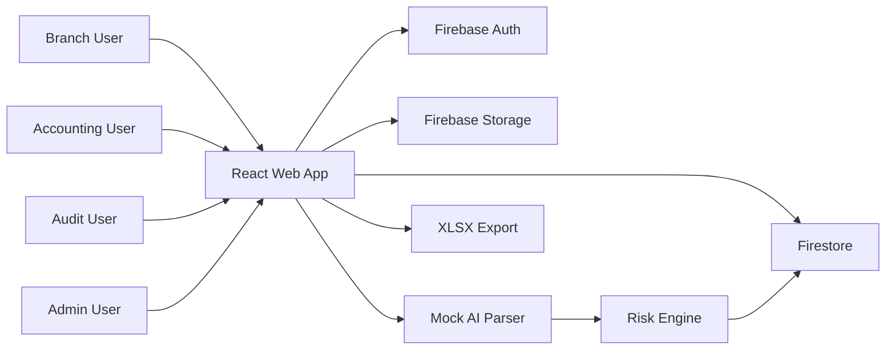

# 01 Project Overview

## ชื่อระบบ

D-FARM Pay-in AI V1

## วัตถุประสงค์

ระบบนี้ใช้สำหรับควบคุมกระบวนการส่งยอด Pay-in ของสาขา โดยให้สาขาอัปโหลดเอกสารหลัก 3 ประเภท ได้แก่ รูปสรุปยอด POS, ใบ Pay-in และสลิปโอน จากนั้นระบบจะใช้ AI Parser อ่านข้อมูลจากเอกสาร เปรียบเทียบยอดสำคัญ คำนวณความเสี่ยง ส่งให้ Accounting ตรวจสอบ และเปิดให้ Audit ดูรายงานย้อนหลัง

## ผู้ใช้งานหลัก

| Role | หน้าที่ |
| --- | --- |
| Admin | จัดการสาขาและผู้ใช้งาน |
| Branch | สร้างรายการ Pay-in และอัปโหลดเอกสาร |
| Accounting | ตรวจสอบรายการ, อนุมัติ, หรือส่งกลับ |
| Audit | ดู dashboard, ตรวจ audit log, export Excel |

## Tech Stack

| Layer | Technology |
| --- | --- |
| Frontend | React + Vite |
| Authentication | Firebase Auth |
| Database | Firestore |
| File Storage | Firebase Storage |
| Export | XLSX |
| OCR/AI V1 | Mock AI Parser |

## Scope V1

- Login ด้วย Firebase Auth หรือ Demo mode
- Role-based UI
- Branch submit Pay-in record
- Upload เอกสาร 3 รูป
- Mock AI OCR แยกตาม Document Type
- Compare POS Summary, Pay-in slip, Transfer slip
- Risk Engine
- Accounting approve/return
- Audit dashboard และ export Excel
- Admin settings สำหรับ branches/users
- Audit log ทุกการเปลี่ยนแปลง
- ไม่อนุญาตให้ลบ Pay-in record

## Non-Scope V1

- ยังไม่ต่อ AI OCR จริง
- ยังไม่มี backend API server แยก
- ยังไม่มี notification
- ยังไม่มี retry queue สำหรับ AI parsing
- ยังไม่มี multi-level approval

## High-Level Architecture

## Security Principles

- Branch เห็นเฉพาะรายการของสาขาตัวเอง
- Accounting, Audit, Admin เห็นทุกสาขา
- Firestore rules ต้อง enforce role และ branch visibility
- Storage rules ต้องจำกัดเฉพาะ image file
- Audit log ห้ามแก้ไขและห้ามลบ
- Pay-in records ห้ามลบ

