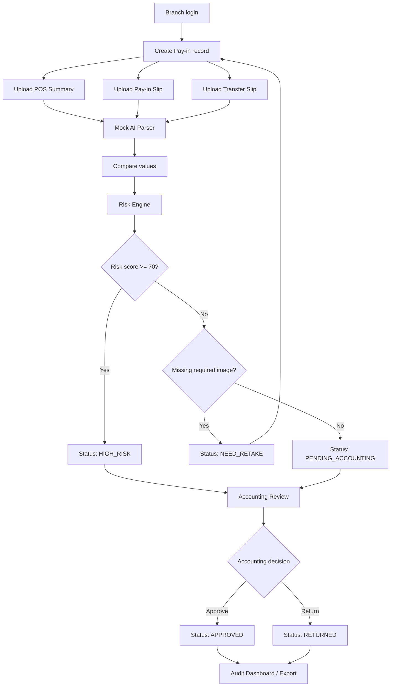

# 02 Workflow

## ภาพรวม Workflow

## 1. Branch Submit

Branch กรอกข้อมูลรายการ:

- date
- branch
- shift
- expectedAmount
- branchAmount
- transferSlipAmount
- referenceNo
- bankName

Branch อัปโหลดเอกสาร 3 ประเภท:

- POS_SUMMARY
- PAYIN_SLIP
- TRANSFER_SLIP

ระบบสร้าง record id เช่น `PAY-YYYYMMDD-xxxxxx`

## 2. Upload Documents

เมื่ออัปโหลดไฟล์ ระบบต้อง:

- คำนวณ image hash
- บันทึกไฟล์เข้า Firebase Storage
- เก็บ download URL ใน Firestore
- เก็บ timeline ตามประเภทเอกสาร

Timeline ที่เกี่ยวข้อง:

| Event | Field |
| --- | --- |
| สร้าง record | createdAt |
| อัปโหลด POS Summary | posSummaryUploadedAt |
| อัปโหลด Pay-in | payinUploadedAt |
| อัปโหลด Transfer slip | transferSlipUploadedAt |

## 3. AI Parsing

ระบบเรียก parser แยกตาม Document Type:

- `mockAIExtractDocument(image, POS_SUMMARY, context)`
- `mockAIExtractDocument(image, PAYIN_SLIP, context)`
- `mockAIExtractDocument(image, TRANSFER_SLIP, context)`

หลัง parse เสร็จต้องบันทึก:

- aiDocuments
- aiConfidence
- aiStatus
- aiCheckedAt

## 4. Compare Values

ระบบเปรียบเทียบข้อมูลหลัก:

| Rule | Expected |
| --- | --- |
| POS cashToDepositAmount vs Pay-in amount | ต้องตรงกัน |
| POS transferAmount + maemaneeAmount vs Transfer slip total | ต้องตรงกัน |
| POS totalPaidAmount vs netAmount | ต่างได้ไม่เกิน 1 บาท |
| POS saleDate vs Pay-in date | ต้องตรงกัน |

สถานะผลต่าง:

| Status | ความหมาย | สี UI |
| --- | --- | --- |
| match | ตรงกัน | เขียว |
| near | ต่างไม่เกิน 1 บาท | เหลือง |
| mismatch | ต่างเกิน 1 บาท หรือวันที่ไม่ตรง | แดง |

## 5. Risk Engine

Risk Engine รับ record และ records เดิมทั้งหมด เพื่อตรวจ:

- missing document
- amount mismatch
- date mismatch
- low AI confidence
- duplicate referenceNo
- duplicate imageHash

ผลลัพธ์:

- riskScore
- riskFlags
- status suggestion

## 6. Submit to Accounting

หลัง AI check:

- ถ้า riskScore >= 70: `HIGH_RISK`
- ถ้าเอกสารไม่ครบ: `NEED_RETAKE`
- ถ้าผ่านเงื่อนไขพื้นฐาน: `PENDING_ACCOUNTING`

บันทึก timeline:

- submittedToAccountingAt

## 7. Accounting Review

Accounting เห็นทุกสาขาและตรวจข้อมูล 3 ฝั่ง:

- POS Summary
- Branch Input
- AI OCR Result

Accounting ทำได้:

- Approve: status เป็น `APPROVED`
- Return: status เป็น `RETURNED`
- ใส่ accountingComment

บันทึก:

- reviewedBy
- reviewedAt
- timeline.reviewedAt

## 8. Audit

Audit เห็น:

- dashboard summary
- Pay-in report
- risk score / risk flags
- audit log
- export Excel

## 9. Audit Log

ทุก create/update ต้องสร้าง audit log:

- CREATE_PAYIN
- APPROVE_PAYIN
- RETURN_PAYIN
- UPSERT_BRANCHES
- UPSERT_USERS

Audit log ห้ามแก้ไขและห้ามลบ

