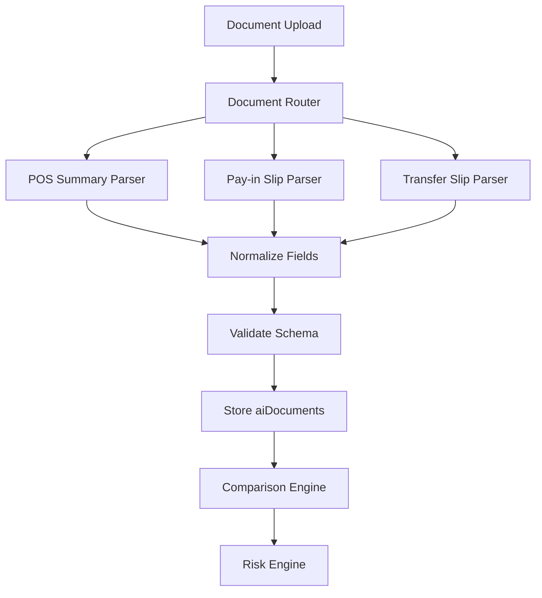

# 05 AI Parser Design

## Objective

ออกแบบ AI Parser ให้แยกตาม Document Type เพื่อให้ V1 ใช้ mock ได้ และในอนาคตเปลี่ยนเป็น AI OCR จริงได้โดยไม่กระทบ UI, database และ Risk Engine มากเกินไป

## Parser Interface

```ts
type DocumentType = 'POS_SUMMARY' | 'PAYIN_SLIP' | 'TRANSFER_SLIP';

type ParserInput = {
  file?: File;
  url?: string;
  hash?: string;
  documentType: DocumentType;
  context: {
    date: string;
    branch: string;
    branchAmount?: number;
    transferSlipAmount?: number;
    referenceNo?: string;
    bankName?: string;
  };
};

type ParserOutput<TFields> = {
  documentType: DocumentType;
  confidence: number;
  extractedAt: string;
  fields: TFields;
  rawText?: string;
  warnings?: string[];
};
```

## Current V1 Function

```js
mockAIExtractDocument(image, documentType, context)
```

V1 behavior:

- คืนค่าจำลองตาม documentType
- สร้าง confidence จาก image hash
- ใช้ context จาก form เพื่อ mock amount/date/reference
- ยังไม่อ่านภาพจริง

## Parser Components



## Document Router

Router รับ `documentType` แล้วเลือก parser ที่ถูกต้อง

```ts
const parsers = {
  POS_SUMMARY: parsePosSummary,
  PAYIN_SLIP: parsePayinSlip,
  TRANSFER_SLIP: parseTransferSlip
};
```

## POS Summary Parser

### Input

- รูปใบสรุปยอด POS
- context.date
- context.branch

### Output Fields

- branchCode
- branchName
- saleDate
- closeTime
- till
- taxId
- registerNo
- billCount
- grossAmount
- discountAmount
- netAmount
- cashAmount
- debtorTransferAmount
- transferAmount
- maemaneeAmount
- couponAmount
- totalPaidAmount
- cashToDepositAmount
- cashierCode

### Normalization

- แปลงตัวเลขที่มี comma เป็น number
- แปลงวันที่ พ.ศ. เป็น ค.ศ. สำหรับ comparison
- trim ช่องว่างและอักขระพิเศษ
- map label ภาษาไทยจากใบ POS เป็น field กลาง

## Pay-in Slip Parser

### Output Fields

- amount
- referenceNo
- bankName
- date

### Normalization

- amount เป็น number
- referenceNo เป็น uppercase string
- date เป็น `YYYY-MM-DD`

## Transfer Slip Parser

### Output Fields

- totalAmount
- referenceNo
- date

### Normalization

- totalAmount เป็น number
- referenceNo เป็น uppercase string
- date เป็น `YYYY-MM-DD`

## Error Handling

Parser ควรคืน warnings แทนการ throw error เมื่ออ่านบาง field ไม่ได้

ตัวอย่าง:

```json
{
  "documentType": "POS_SUMMARY",
  "confidence": 72,
  "fields": {},
  "warnings": [
    "cashToDepositAmount not found",
    "saleDate low confidence"
  ]
}
```

## Confidence Policy

| Confidence | Meaning | Action |
| --- | --- | --- |
| >= 90 | สูง | ใช้ผลอ่านได้ |
| 80-89 | ปกติ | ใช้ผลอ่านได้ |
| 70-79 | ต่ำ | เพิ่ม LOW_AI_CONFIDENCE |
| < 70 | ต่ำมาก | แนะนำ NEED_RETAKE |

## Future Real AI Integration

เมื่อเปลี่ยนเป็น AI จริง แนะนำแยก service:

- `aiParserClient.extractDocument(input)`
- `parsePosSummary(result)`
- `parsePayinSlip(result)`
- `parseTransferSlip(result)`

AI Provider อาจเป็น:

- OCR engine
- Vision model
- Document AI
- Custom parser service

## Parser Contract Tests

ควรมี test ต่อ documentType:

- input image fixture
- expected normalized fields
- expected confidence threshold
- expected warnings

