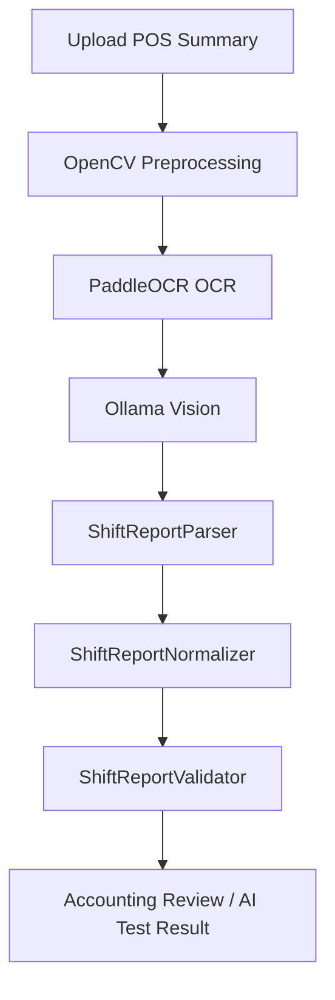

# Shift Report AI

## Objective

Sprint 18 starts local AI processing for POS Summary or shift closing reports. The system only supports free local components:

- OpenCV for image quality and preprocessing
- PaddleOCR for local OCR
- Ollama Vision for local document analysis
- Mock AI fallback when Ollama is unavailable

The implementation must not use OpenAI, Gemini, Claude, paid APIs, or external cloud APIs.

## Architecture



Core modules:

- `ShiftReportPrompt.js` builds the local Ollama prompt for POS Summary extraction.
- `ShiftReportParser.js` orchestrates OpenCV, PaddleOCR, Ollama, mapping, normalization, and validation.
- `ShiftReportMapper.js` maps OCR text and AI fields into system field names.
- `ShiftReportNormalizer.js` converts money, dates, and time into standard formats.
- `ShiftReportValidator.js` checks payment totals and emits risk flags.

## Workflow

1. User uploads a POS Summary image.
2. OpenCV preprocesses the image.
3. PaddleOCR extracts raw text and text blocks.
4. Ollama analyzes the document using the POS Summary prompt.
5. Parser maps AI/OCR output into structured fields.
6. Normalizer converts values:
   - Amounts to decimal numbers
   - Dates to ISO format
   - Times to `HH:mm:ss`
7. Validator checks payment totals.
8. Result is shown in Shift Report AI Test and can later feed Accounting Review.

## Fields

Branch:

- `branchCode`
- `branchName`

Shift:

- `businessDate`
- `shift`
- `openTime`
- `closeTime`
- `cashierCode`
- `cashierName`

Sales:

- `billCount`
- `grossAmount`
- `discountAmount`
- `netAmount`

Payments:

- `cashAmount`
- `debtorTransferAmount`
- `bankTransferAmount`
- `maemaneeAmount`
- `crmCouponAmount`
- `totalPaymentAmount`

Other:

- `registerNo`
- `taxId`

## Field Mapping

| OCR Text | Field | AI Result | Human Correction |
|---|---|---|---|
| Raw OCR line or full text context | Target normalized field | Value returned by AI/parser | User-corrected value |

The Field Mapping Viewer stores every correction with:

- `documentType`
- `filename`
- `field`
- `ocrText`
- `aiResult`
- `humanCorrection`
- `confidence`
- `changedAt`

## Validation Rule

The validator checks:

```text
cashAmount
+ debtorTransferAmount
+ bankTransferAmount
+ maemaneeAmount
+ crmCouponAmount
= totalPaymentAmount
```

If the difference is greater than 1 baht, the system adds:

- `PAYMENT_TOTAL_MISMATCH`

Validation result:

```json
{
  "valid": false,
  "flags": ["PAYMENT_TOTAL_MISMATCH"],
  "paymentTotal": 0,
  "expectedTotal": 0,
  "difference": 0,
  "status": "FAIL"
}
```

## Confidence

Each field includes AI confidence.

- `>= 90%`: normal
- `< 90%`: yellow highlight
- `< 70%`: red highlight

Low confidence fields should be reviewed by Accounting before approval.

## Fallback

Ollama unavailable:

- The parser uses `MOCK_AI` fallback.
- The result still returns normalized mock fields for development and testing.

PaddleOCR unavailable:

- The parser adds `OCR_OFFLINE` warning.
- The page displays the warning and continues with mock fallback where possible.

## Correction History

When a user edits a field in the Field Mapping Viewer, the system records correction history in local storage. This prepares the future Accounting correction flow without requiring Firestore yet.

Correction history is append-only and should not be deleted automatically.

## AI Learning Dataset

Every human correction also creates an AI learning dataset item:

- `documentType`
- `field`
- `ocrText`
- `aiResult`
- `humanCorrection`
- `source`
- `createdAt`

This dataset can later be exported and used to improve local prompts, template rules, or model fine-tuning outside the production system.
