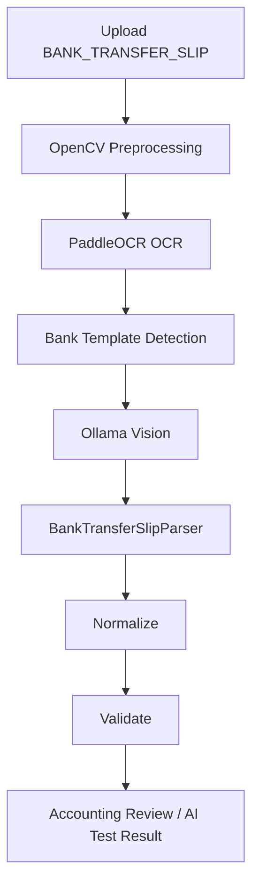

# Bank Transfer Slip AI

## Objective

Sprint 19 adds local AI processing for mobile banking transfer slips. The system supports only free local providers:

- OpenCV
- PaddleOCR
- Ollama
- Mock fallback

The system must not use OpenAI, Gemini, Claude, paid APIs, or external cloud APIs.

## Workflow

## Supported Templates

| Bank | Template |
|---|---|
| KBANK | K PLUS |
| SCB | SCB Easy |
| KTB | Krungthai NEXT |
| BBL | BBL Mobile Banking |
| BAY | Krungsri Mobile |
| GSB | GSB Mobile Banking |
| PROMPTPAY | PromptPay Slip |
| UNKNOWN | Unknown Bank Slip |

Template detection uses local rules only:

- Filename
- OCR text
- Known bank keywords
- PromptPay keywords

## Fields

The parser extracts:

- `transferAmount`
- `transferDate`
- `transferTime`
- `referenceNo`
- `bankName`
- `fromBank`
- `fromAccountName`
- `fromAccountNoMasked`
- `toBank`
- `toAccountName`
- `toAccountNoMasked`
- `promptPayId`
- `transactionId`
- `qrRef`
- `confidence`

## Normalization

- Amounts are converted to decimal numbers.
- Dates are converted to ISO format.
- Times are converted to `HH:mm:ss`.
- Reference numbers remove unnecessary spaces and symbols.
- Bank names are normalized to `KBANK`, `SCB`, `KTB`, `BBL`, `BAY`, `GSB`, `PROMPTPAY`, or `UNKNOWN`.

## Validation Rules

| Rule | Risk Flag |
|---|---|
| `transferAmount` is missing | `TRANSFER_AMOUNT_MISSING` |
| `transferDate` is missing | `TRANSFER_DATE_MISSING` |
| Both `referenceNo` and `transactionId` are missing | `REFERENCE_OR_TRANSACTION_MISSING` |
| `referenceNo` already exists | `DUPLICATE_REFERENCE_NO` |
| Destination account name does not match company account | `WRONG_DESTINATION_ACCOUNT` |
| Slip date does not match business date | `DATE_MISMATCH` |
| Slip amount does not match POS bank transfer amount | `BANK_TRANSFER_MISMATCH` |

## Duplicate Reference Rule

Duplicate detection checks the normalized `referenceNo` against existing records and current dataset references.

If a duplicate is found:

- Validation status becomes `FAIL`
- Risk flag includes `DUPLICATE_REFERENCE_NO`
- Accounting should not approve without review

## Field Mapping

The Field Mapping Viewer displays:

| OCR Text | Field | AI Result | Human Correction |
|---|---|---|---|
| Raw OCR context | Target field | Parsed value | Accounting correction |

Field confidence is highlighted:

- `>= 90%`: normal
- `< 90%`: yellow
- `< 70%`: red

## Correction History

When Accounting edits a field, the system records:

- `recordId`
- `documentId`
- `documentType`
- `field`
- `ocrText`
- `aiResult`
- `humanCorrection`
- `confidence`
- `changedAt`

The history is append-only in mock local storage for V1.

## AI Learning Dataset

Every correction creates a learning item:

- `documentType`
- `field`
- `ocrText`
- `aiResult`
- `humanCorrection`
- `source`
- `createdAt`

This dataset can later improve:

- Template rules
- Regex rules
- Local prompts
- Future local model fine-tuning

## Fallback

Ollama unavailable:

- The parser returns `provider: "MOCK_AI"`
- Mock parsed data is used so the UI does not break

PaddleOCR unavailable:

- The parser adds `OCR_OFFLINE`
- The page continues to show mock/fallback output

OpenCV unavailable:

- Preprocessing uses mock fallback
- The parser continues with the original image
