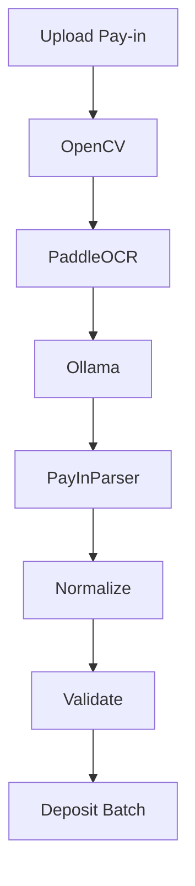
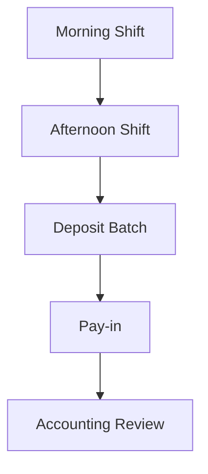

# Deposit Batch Engine

## Objective

Sprint 20 adds the Deposit Batch Engine and local AI Pay-in parsing. The goal is to validate real cash deposit workflow by batch, not by a single shift.

Allowed local providers:

- OpenCV
- PaddleOCR
- Ollama
- Mock fallback

Not allowed:

- OpenAI
- Gemini
- Claude
- Paid APIs
- External cloud APIs

## Business Rule

Cash deposit must be validated through a Deposit Batch.

Expected cash:

```text
Previous day afternoon shift cash
+ Next day morning shift cash
= Expected Cash Amount
```

Actual deposit:

```text
Sum of all Pay-in documents in the batch
```

Difference:

```text
Actual Deposit - Expected Cash
```

Important rule:

- Do not validate cash against only one shift.
- Cash validation must go through Deposit Batch.

## Branch Shift Policy

Shift times must not be hardcoded in validation logic. They must come from `BranchShiftPolicy`.

Fields:

- `branchCode`
- `morningStartTime`
- `morningEndTime`
- `afternoonStartTime`
- `afternoonEndTime`
- `effectiveFrom`
- `effectiveTo`
- `isActive`

Admin can manage policies from Admin Settings.

## Deposit Batch Entity

```json
{
  "batchId": "",
  "branchCode": "",
  "depositDate": "",
  "status": "",
  "expectedCashAmount": 0,
  "actualPayInAmount": 0,
  "difference": 0,
  "riskScore": 0,
  "riskFlags": [],
  "includedShifts": [],
  "payInDocuments": [],
  "createdAt": "",
  "updatedAt": ""
}
```

## Included Shifts

```json
[
  {
    "businessDate": "",
    "shift": "",
    "cashAmount": 0,
    "shiftReportId": ""
  }
]
```

## Pay-in Documents

```json
[
  {
    "documentId": "",
    "documentType": "",
    "depositAmount": 0,
    "referenceNo": ""
  }
]
```

Multiple Pay-in documents are summed before validation.

## AI Pay-in Parser

Supported document types:

- `PAYIN_BANK_COUNTER`
- `PAYIN_ATM`
- `PAYIN_COUNTER_SERVICE`
- `PAYIN_LOTUS`

Fields:

- `payInType`
- `bankName`
- `branchName`
- `transactionDate`
- `transactionTime`
- `depositAmount`
- `feeAmount`
- `referenceNo`
- `slipNo`
- `terminalId`
- `machineId`
- `accountName`
- `accountNumberMasked`
- `confidence`

Workflow:



Fallback:

- Ollama offline: use Mock AI
- PaddleOCR offline: return `OCR_OFFLINE` warning
- UI must not crash

## Validation

| Rule | Risk Flag |
|---|---|
| Expected cash does not match actual Pay-in total | `CASH_DEPOSIT_BATCH_MISMATCH` |
| Duplicate Pay-in reference | `PAYIN_REFERENCE_DUPLICATE` |
| Wrong deposit bank account | `WRONG_BANK_ACCOUNT` |
| Deposit date mismatch | `DEPOSIT_DATE_MISMATCH` |
| Pay-in amount mismatch | `PAYIN_AMOUNT_MISMATCH` |
| Shift report time outside branch policy | `SHIFT_TIME_OUT_OF_POLICY` |

## Risk

Deposit Batch risk is calculated from validation flags.

High risk examples:

- Duplicate reference
- Wrong bank account
- Cash deposit batch mismatch

## Accounting Review

Accounting Review includes a Deposit Batch section showing:

- Deposit Date
- Expected Cash
- Actual Deposit
- Difference
- Status
- Risk
- Included Shifts
- Pay-in Documents

Accounting can review morning and afternoon shift references together through the batch view.

## Deposit Batch Viewer

The Deposit Batch Viewer supports:

- Date filter
- Branch filter
- Status filter
- Risk filter
- Difference filter
- Search by batch ID, reference, or branch

## Timeline



## Correction History

When Accounting edits AI extracted fields, the system records correction history.

Correction history includes:

- `recordId`
- `documentId`
- `documentType`
- `field`
- `ocrText`
- `aiResult`
- `humanCorrection`
- `confidence`
- `changedAt`

## AI Learning

Every correction creates an AI learning dataset item automatically.

The dataset can later improve:

- Pay-in parser prompts
- Template rules
- Local regex mapping
- Future local model tuning

## Dashboard

Audit Dashboard includes Deposit Batch Summary:

- Total batches
- PASS
- FAIL
- Difference total
