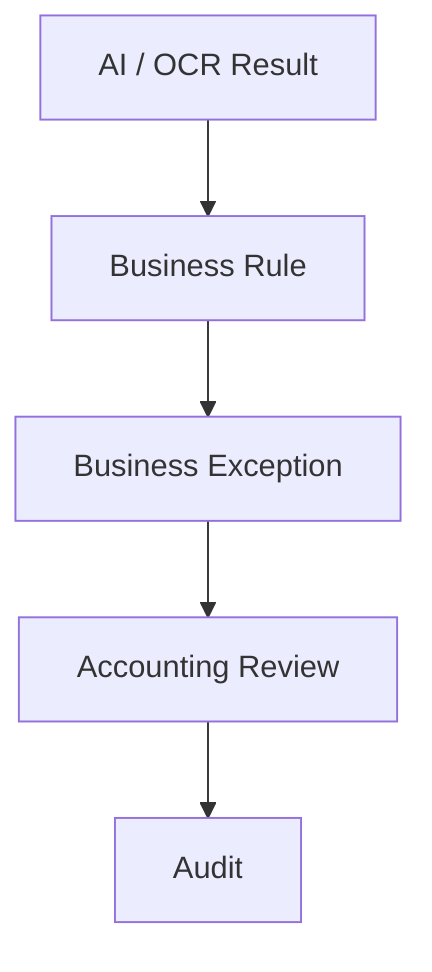

# Business Exception Engine

## Objective

Sprint 23 adds the Business Exception Engine for detecting abnormal shift-closing conditions based on company business rules.

Allowed local providers:

- Ollama
- PaddleOCR
- OpenCV

Not allowed:

- OpenAI
- Gemini
- Claude
- Paid APIs

## Key Principle

Business Exception is not always Fraud.

The system must not decide that fraud happened. The system only:

- Detects exceptions
- Explains business rule violations
- Calculates risk score
- Prioritizes review work
- Alerts Accounting and Audit

Accounting or Audit decides whether an exception is a real issue, false positive, operational exception, or fraud risk.

## Architecture



Business logic is separated from AI. AI providers can change without changing business rules.

## Module

`src/business-exception/`

- `BusinessExceptionEngine.js`
- `BusinessRuleValidator.js`
- `RiskScoreCalculator.js`
- `ExceptionClassifier.js`
- `ExceptionRepository.js`
- `BusinessPolicyService.js`

## Entity

`BusinessException`

```json
{
  "exceptionId": "",
  "branchCode": "",
  "businessDate": "",
  "shift": "",
  "severity": "",
  "category": "",
  "ruleCode": "",
  "description": "",
  "expectedValue": "",
  "actualValue": "",
  "difference": 0,
  "status": "",
  "assignedTo": "",
  "resolvedBy": "",
  "resolvedAt": "",
  "createdAt": ""
}
```

## Severity

- `INFO`
- `WARNING`
- `HIGH`
- `CRITICAL`

## Exception Category

- `DOCUMENT`
- `PAYMENT`
- `SHIFT`
- `BUSINESS_DATE`
- `AMOUNT`
- `REFERENCE`
- `AI`
- `SYSTEM`

## Business Rules

The engine checks:

1. Missing Document
2. Total amount mismatch
3. Duplicate reference
4. Wrong shift
5. Wrong business date
6. Pay-in over amount
7. Pay-in short amount
8. Bank transfer over amount
9. MaeManee over amount
10. CRM over amount
11. Debtor transfer over amount
12. Low AI confidence
13. Incomplete OCR
14. Manual Override
15. Accounting Override
16. Audit Override

## Risk Score

Risk score range:

```text
0 - 100
```

Example weights:

| Rule | Score |
|---|---:|
| Missing Document | 30 |
| Difference | 20 |
| Duplicate Reference | 25 |
| Wrong Shift | 15 |
| Low AI Confidence | 10 |

## Risk Level

| Score | Level |
|---:|---|
| 0-20 | PASS |
| 21-40 | LOW |
| 41-60 | MEDIUM |
| 61-80 | HIGH |
| 81-100 | CRITICAL |

## Accounting Workflow

Accounting Review includes Business Exception Panel:

- Risk Score
- Severity
- Exception
- Status
- Assigned user/team

Allowed actions:

- Resolve
- Reject
- Ignore
- Comment
- Assign
- Mark False Positive

Every action creates an audit log.

## False Positive

False Positive must be stored for AI learning.

False positive records include:

- Exception ID
- Rule code
- Branch
- Business date
- Shift
- Comment
- Timestamp

## Audit Workflow

Audit can view exception history:

- Open exceptions
- Resolved exceptions
- False positives
- Overrides
- Branch ranking
- Trend

## Notifications

Supported now:

- In-app notification

Future:

- Email
- LINE Notify
- Microsoft Teams

## Dashboard

Dashboard includes:

- Business Exception Today
- Open
- Resolved
- Critical
- High Risk Branch
- Branch Ranking Top 10
- Trend 7 days / 30 days / 90 days

## Scalability

The design supports:

- 100+ branches
- 200+ branches
- Millions of documents

Scalability principles:

- Exception generation should run as background jobs.
- UI should query by branch/date/status/severity.
- Audit history should be paginated.
- Business logic should not depend on fixed branch count.
- AI processing can fail without breaking business rules.

## Performance

Exception creation must be background-job friendly and must not block UI at scale.

Current mock implementation stores exceptions with each record and can be moved to a background worker or Firestore collection later without changing rule logic.

## Fraud Boundary

The system must never label a case as fraud by itself.

It can only show:

- Business Exception
- Risk Score
- Risk Level
- Evidence
- Suggested review priority

Final fraud interpretation belongs to Accounting or Audit.
