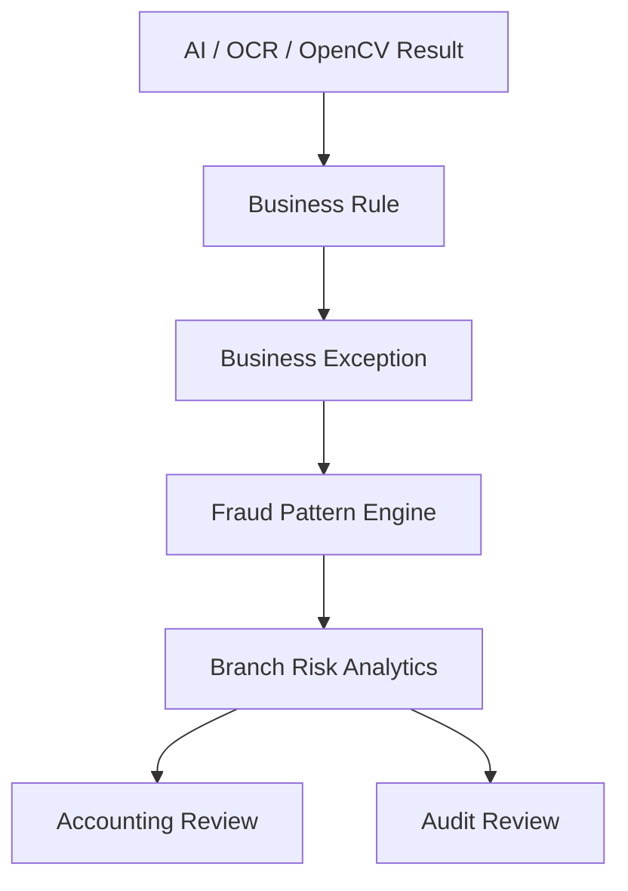

# 22. Fraud Pattern Engine & Branch Risk Analytics

## Objective

Fraud Pattern Engine is a risk alert and analytics layer for D-FARM Pay-in AI. It detects repeated abnormal behavior across shifts, branches, documents, and accounting actions.

The engine does not decide that fraud happened. It only creates alerts, scores, rankings, and review queues. Accounting, Audit, and management make the final decision.

## Architecture



Business logic is separated from AI providers. The pattern engine reads normalized records, business exceptions, risk flags, manual overrides, correction history, and audit outcomes. It does not call OpenAI, Gemini, Claude, or any paid API.

## Module

Folder: `src/fraud-pattern/`

Files:

- `FraudPatternEngine.js`
- `BranchRiskAnalyzer.js`
- `BehaviorAnalyzer.js`
- `RiskTrendService.js`
- `PatternDetectionService.js`
- `FraudScoreCalculator.js`
- `BranchHealthService.js`

## Entities

### BranchRiskProfile

| Field | Description |
|---|---|
| branchCode | Branch code used for matching and analytics |
| branchName | Branch display name |
| currentRiskScore | Current score from 0-100 |
| riskLevel | PASS, LOW, MEDIUM, HIGH, CRITICAL |
| branchHealth | Excellent, Good, Warning, Critical |
| lastUpdated | Last profile calculation time |

### FraudPattern

| Field | Description |
|---|---|
| patternId | Unique pattern id |
| branchCode | Branch code |
| patternCode | Rule code |
| patternName | Human readable rule name |
| severity | LOW, MEDIUM, HIGH, CRITICAL |
| description | Detection summary |
| occurrenceCount | Number of occurrences in the detection window |
| firstDetected | First detected datetime |
| lastDetected | Last detected datetime |
| status | OPEN, RESOLVED, FALSE_POSITIVE, LOCKED_CASE, REOPENED_CASE |
| createdAt | Creation datetime |

## Detectable Patterns

The engine supports the following pattern codes:

- `TOTAL_MISMATCH_CONSECUTIVE`
- `MISSING_DOCUMENT_REPEATED`
- `MANUAL_OVERRIDE_FREQUENT`
- `ACCOUNTING_OVERRIDE_FREQUENT`
- `AUDIT_OVERRIDE_FREQUENT`
- `DUPLICATE_REFERENCE_REPEATED`
- `LATE_PAYIN_REPEATED`
- `WRONG_DEPOSIT_DATE_REPEATED`
- `LOW_AI_CONFIDENCE_CONTINUOUS`
- `OCR_FAILURE_FREQUENT`
- `INCOMPLETE_ATTACHMENT_REPEATED`
- `MANUAL_MATCH_FREQUENT`
- `HIGH_RISK_CONTINUOUS`
- `DIFFERENCE_OVER_THRESHOLD_REPEATED`
- `LATE_DOCUMENT_SUBMISSION`
- `INCOMPLETE_DOCUMENT_SUBMISSION`

## Configurable Business Rules

Pattern rules are configurable and must not require code changes in production.

Rule shape:

```json
{
  "patternCode": "CUSTOM_RULE",
  "patternName": "Repeated custom behavior",
  "severity": "HIGH",
  "metric": "differenceCount",
  "threshold": 3,
  "isActive": true
}
```

In the current mock implementation, rules are stored in localStorage. In Firebase, this should move to a Firestore collection such as `fraudPatternRules`.

## Risk Score

Risk score is calculated from detected patterns and capped at 100.

Example weighting:

| Severity | Base Score |
|---|---:|
| LOW | 6 |
| MEDIUM | 12 |
| HIGH | 18 |
| CRITICAL | 25 |

Occurrence count adds additional weight, capped per pattern to avoid unlimited growth.

## Risk Level

| Score | Level |
|---:|---|
| 0-20 | PASS |
| 21-40 | LOW |
| 41-60 | MEDIUM |
| 61-80 | HIGH |
| 81-100 | CRITICAL |

## Branch Health

| Score | Health |
|---:|---|
| 0-20 | Excellent |
| 21-40 | Good |
| 41-70 | Warning |
| 71-100 | Critical |

## Branch Risk Dashboard

Dashboard sections:

- Top 20 High Risk Branch
- Top 20 Low Risk Branch
- Most Missing Document
- Most Manual Override
- Most Difference
- Most Late Deposit
- Most AI Correction
- Most OCR Failure
- Risk Trend for 7, 30, 90, 180, and 365 days
- Branch Comparison
- Branch Risk Heat Map
- Risk Alerts
- Detected Pattern Action Panel

## Accounting Workflow

Accounting can:

- Comment
- Resolve
- Mark False Positive

Every action must create an audit log. False positives are stored for AI learning so that future local models and rule engines can learn which alerts are not useful.

## Audit Workflow

Audit can:

- Lock Case
- Reopen Case
- Assign Investigation

Audit sees all branch history and every pattern action. Audit actions must also create audit logs.

## False Positive Learning

False positive records should include:

- patternId
- patternCode
- branchCode
- actor
- role
- createdAt
- reason or comment

These records become part of the AI learning dataset and rule tuning process. They do not change historical accounting data.

## Security

- Branch users see only their own branch and do not access branch risk analytics.
- Accounting can access review functions based on permission.
- Audit can see all branches and investigation history.
- Admin can manage configurable pattern rules.

## Scalability

The production design must support:

- 100+ branches
- 500+ branches
- Millions of documents
- Large audit history
- Background processing jobs
- Paginated branch analytics
- Indexed queries by branch, business date, shift, status, risk level, and pattern code

The UI must not load all records at once in production. It should use filtered queries, pagination, lazy loading, and precomputed daily branch risk snapshots.

## Recommended Firestore Collections

| Collection | Purpose |
|---|---|
| `branchRiskProfiles` | Current branch risk profile |
| `fraudPatterns` | Detected patterns |
| `fraudPatternRules` | Configurable rule set |
| `branchRiskDailySnapshots` | Daily score history |
| `fraudPatternActions` | Resolve, false positive, lock, reopen, assign actions |
| `aiLearningDataset` | Human corrections and false positive learning |
| `auditLogs` | Immutable audit trail |

## Performance

Fraud pattern analysis should be generated by a background job, not by the UI thread. The current V1 mock implementation calculates from local records for demo use only. Production should write snapshots that the dashboard reads directly.

## Important Principle

Business Exception is not fraud. Fraud Pattern is not proof of fraud. The system ranks risk and raises alerts; humans decide the case outcome.
