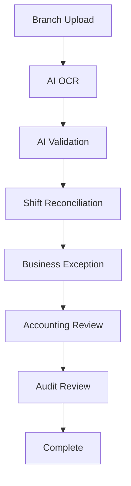

# 23. Enterprise Workflow Engine

## Objective

Enterprise Workflow Engine controls real operating work for D-FARM Pay-in AI across branches, Accounting, Audit, Regional Manager, Admin, and Executive users.

The workflow layer is responsible for routing, assignment, SLA, timeline, comment, attachment, notification, permission, and history. It is not responsible for AI parsing or business validation. AI and business logic remain separate modules.

No paid AI provider is required. The system continues to support only local/free providers: Ollama, PaddleOCR, and OpenCV.

## End-to-End Workflow



## Module

Folder: `src/workflow/`

Files:

- `WorkflowEngine.js`
- `WorkflowService.js`
- `WorkflowRepository.js`
- `WorkflowRuleEngine.js`
- `WorkflowHistoryService.js`
- `WorkflowNotificationService.js`
- `WorkflowAssignmentService.js`
- `WorkflowPermissionService.js`

## Entity: WorkflowCase

| Field | Description |
|---|---|
| caseId | Unique workflow case id |
| branchCode | Branch code |
| branchName | Branch display name |
| businessDate | Business date |
| shift | Morning or Afternoon |
| workflowType | Workflow type, for example `SHIFT_RECONCILIATION` |
| currentStep | Current workflow step |
| currentStatus | Current workflow status |
| priority | LOW, NORMAL, HIGH, URGENT, CRITICAL |
| riskScore | Risk score from business/risk modules |
| assignedRole | Current responsible role |
| assignedUser | Current assigned user |
| assignedBranch | Current assigned branch |
| assignedRegion | Current assigned region |
| dueDate | SLA due datetime |
| slaMinutes | SLA target in minutes |
| createdAt | Created datetime |
| updatedAt | Last updated datetime |
| completedAt | Completed datetime |
| comments | Case comment list |
| attachments | Additional attachment metadata |
| timeline | Workflow event history |

## Workflow Steps

| Step | Meaning |
|---|---|
| `DRAFT` | Case is drafted |
| `WAITING_AI` | Waiting for local AI/OCR pipeline |
| `WAITING_ACCOUNTING` | Waiting for Accounting review |
| `WAITING_BRANCH` | Waiting for branch correction or additional document |
| `WAITING_AUDIT` | Waiting for Audit review |
| `WAITING_MANAGER` | Waiting for Regional Manager |
| `COMPLETED` | Workflow completed |
| `REJECTED` | Workflow rejected |

## Workflow Status

- `OPEN`
- `IN_PROGRESS`
- `WAITING`
- `RETURNED`
- `APPROVED`
- `REJECTED`
- `COMPLETED`

## Priority

Priority is derived from risk score by default.

| Risk Score | Priority |
|---:|---|
| 0-24 | LOW |
| 25-54 | NORMAL |
| 55-74 | HIGH |
| 75-89 | URGENT |
| 90-100 | CRITICAL |

## Assignment

The engine supports:

- Assign User
- Assign Role
- Assign Branch
- Assign Region
- Reassign
- Transfer

Assignment changes are workflow events and must create audit logs.

## SLA

Each case has:

- Due Date
- SLA minutes
- Remaining Time
- Over SLA flag

SLA dashboard includes:

- Over SLA
- Due Today
- Critical Priority

Default mock SLA:

- High risk cases: 240 minutes
- Normal cases: 480 minutes

Production SLA should be configurable by workflow type, priority, branch policy, and holiday calendar.

## Role Workflow

### Branch

Branch can:

- Submit new document
- Reply with comment
- Upload additional document
- View case status

### Accounting

Accounting can:

- Approve
- Reject
- Return
- Comment
- Assign
- Request more document

### Audit

Audit can:

- Review
- Override
- Lock case
- Unlock case
- Assign investigation

### Regional Manager

Regional Manager sees only cases in their region. They can handle cases assigned to `REGIONAL_MANAGER`.

### Executive

Executive has dashboard read-only access.

### Admin

Admin can access and operate all workflows.

## Timeline

Every workflow action creates a timeline event:

- Branch Upload
- AI OCR
- Accounting Review
- Comment
- Approve
- Reject
- Audit Review
- Complete
- Assignment
- Attachment added

Timeline events include actor, role, from step, to step, status, comment, attachments, and created datetime.

## Comment Types

Supported comments:

- Internal Comment
- Branch Comment
- Accounting Comment
- Audit Comment

## Attachments

Workflow attachments can reference:

- PDF
- Excel
- Image

The current V1 demo stores attachment metadata only. Production should store files in Firebase Storage or another storage layer, while Firestore keeps metadata.

## Notification

Current implementation supports in-app notification metadata.

Future channels:

- Email
- LINE
- Microsoft Teams

Notification delivery must be async and must not block workflow actions.

## Dashboard

Dashboard cards:

- My Task
- Pending Review
- Over SLA
- Today
- Completed Today
- Rejected
- Returned

Search fields:

- Case ID
- Branch
- Business Date
- Shift
- Workflow Status
- Assigned User
- Risk Level

## Permission

Permission is role based.

| Role | Access |
|---|---|
| Branch | Own branch workflow |
| Accounting | All accounting workflow |
| Audit | All audit workflow |
| Regional Manager | Assigned region |
| Admin | All workflow |
| Executive | Dashboard read only |

## Audit

Every workflow action must create an audit log:

- Transition
- Comment
- Assignment
- Reassignment
- Transfer
- Attachment metadata
- Lock/unlock
- Approve/reject/return

Audit logs are immutable.

## Performance

Production workflow processing should use background jobs for:

- Case creation from records
- AI pipeline status update
- Notification fan-out
- SLA recalculation
- Over SLA alert
- Workflow history archival

The UI should read paginated and filtered workflow cases. It must not load millions of history events at once.

## Scalability

The design supports:

- 100+ branches
- 500+ concurrent users
- Millions of workflow history events
- New workflow types by configuration

Recommended indexed query fields:

- `caseId`
- `branchCode`
- `businessDate`
- `shift`
- `workflowType`
- `currentStep`
- `currentStatus`
- `priority`
- `riskScore`
- `assignedRole`
- `assignedUser`
- `assignedRegion`
- `dueDate`

## Future Workflow Configuration

Workflow types should be configurable:

```json
{
  "workflowType": "SHIFT_RECONCILIATION",
  "steps": ["WAITING_AI", "WAITING_ACCOUNTING", "WAITING_AUDIT", "COMPLETED"],
  "slaMinutesByPriority": {
    "LOW": 480,
    "NORMAL": 480,
    "HIGH": 360,
    "URGENT": 240,
    "CRITICAL": 120
  },
  "allowedTransitions": ["AI_COMPLETE", "ACCOUNTING_APPROVE", "AUDIT_APPROVE"]
}
```

This keeps the engine extensible without changing core business modules.

## Important Principles

1. Workflow Engine is not tied to any single document type.
2. New workflows should be creatable by config.
3. Business logic is separate from workflow routing.
4. Every action creates an audit log.
5. The design must support real operation for 100+ branches and scale beyond 200+ users.
