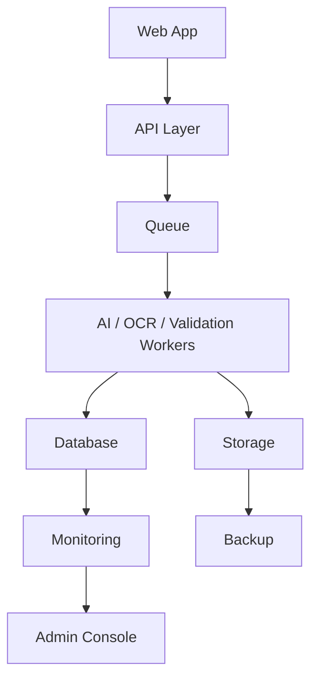

# 24. Enterprise Platform Foundation

## Objective

Enterprise Platform Foundation prepares D-FARM Pay-in AI for organization-scale operation.

Target scale:

- 100+ branches
- 500+ concurrent users
- 100,000+ documents
- 1,000,000+ OCR records
- 10,000,000+ audit logs

The platform layer must not depend on paid AI providers. Supported local/free providers remain:

- Ollama
- PaddleOCR
- OpenCV

## Architecture

Business logic is separated from AI, workflow, storage, database, and queue infrastructure.

## Module

Folder: `src/platform/`

Files:

- `PlatformService.js`
- `SystemHealthService.js`
- `QueueManager.js`
- `WorkerManager.js`
- `StorageManager.js`
- `MonitoringService.js`
- `BackupService.js`
- `DisasterRecoveryService.js`
- `SchedulerService.js`
- `SystemConfigurationService.js`

Every service supports dependency injection through constructor arguments so real implementations can replace mock/local implementations later.

## Queue Engine

Supported queue types:

- `AI_OCR`
- `VALIDATION`
- `RISK`
- `NOTIFICATION`
- `EXPORT`
- `REPORT`

Queue job fields:

- jobId
- type
- payload
- status
- priority
- retryCount
- maxRetry
- timeoutMs
- createdAt
- updatedAt
- lockedBy
- error

Required job actions:

- Pause
- Resume
- Retry
- Fail
- Move to Dead Letter Queue

## Retry and Dead Letter Queue

Default retry limit is 3.

Retry behavior:

1. Job fails.
2. Job returns to queued state if retry count is below limit.
3. Retry count increases.
4. If retry count exceeds limit, job moves to Dead Letter Queue.
5. Admin can inspect and manually retry by creating a new job.

Timeout should be enforced by the worker layer in production.

## Workers

Supported workers:

- OCR Worker
- AI Worker
- Validation Worker
- Reconciliation Worker
- Risk Worker
- Notification Worker

Worker status:

- ONLINE
- IDLE
- PAUSED
- OFFLINE

Workers must report heartbeat, current job, processed count, failed count, and average processing time.

## Health Check

Health check covers:

- API
- Database
- Storage
- Ollama
- PaddleOCR
- OpenCV
- Queue
- Worker

Health status:

- OK
- WARN
- ERROR
- MOCK_ONLINE
- LOCAL_ONLINE

## Storage

Supported storage buckets:

- Original Image
- Thumbnail
- OCR Result
- AI Result
- Correction History
- Audit Log
- Export File
- Backup

Storage metadata must support:

- Version
- Compression
- Archive flag
- Retention policy
- File size
- Created date

Files should live in storage. Database should store metadata only.

## Backup

Backup modes:

- Daily
- Weekly
- Monthly
- Manual Backup
- Restore

Backups should include:

- Firestore or database export
- Storage metadata
- Audit logs
- Workflow history
- Correction history
- AI learning dataset

Production backup must be automated and tested with restore drills.

## Monitoring

Monitoring metrics:

- CPU
- RAM
- Disk
- GPU
- Queue waiting
- Worker status
- AI processing time
- OCR processing time
- Database health
- Storage usage

Performance dashboard fields:

- Average OCR Time
- Average AI Time
- Queue Waiting
- Worker Status
- Storage Usage
- CPU
- RAM
- GPU

## Scheduler

Supported scheduled jobs:

- Auto Cleanup
- Auto Backup
- Auto Retry
- Auto Archive
- Auto Health Check

Schedulers should be managed from Admin Console and recorded in audit logs.

## Security

Security design:

- JWT authentication
- Role Based Access Control
- Permission matrix
- Session timeout
- IP logging
- Device logging
- Audit log for every admin action

Current demo remains mock authentication. Production should enforce Firebase Auth or an enterprise identity provider.

## System Configuration

Admin can configure:

- AI Provider
- OCR Provider
- Queue retry and timeout
- Storage provider
- Business rules
- Risk threshold
- Notification channels
- Workflow settings
- Session timeout
- Retention policy

Configuration must be versioned in production.

## Notification

Current supported channel:

- In App

Future channels:

- Email
- LINE
- Microsoft Teams
- Web Push

Notification delivery must use background jobs and must not block user actions.

## Reports

Supported reports:

- Daily
- Weekly
- Monthly
- Branch
- Accounting
- Audit
- Executive

Reports should be generated through `REPORT` and `EXPORT` queues.

## Database Index Design

Required indexed fields:

- branchCode
- businessDate
- shift
- status
- riskLevel
- workflowStatus
- createdAt

Additional recommended fields:

- documentType
- assignedRole
- assignedUser
- priority
- dueDate
- caseId
- referenceNo

## Scalability

Design scale tiers:

- 100+ branches
- 200+ branches
- 500+ branches
- 1,000+ branches

Rules:

1. Do not load all documents into UI.
2. Use pagination and indexed queries.
3. Use lazy loading for document images.
4. Run AI/OCR/validation/risk as background jobs.
5. Store only metadata in database.
6. Archive old files and logs by retention policy.
7. Partition large audit and history collections by date.
8. Precompute dashboard snapshots.

## Disaster Recovery

Disaster recovery covers:

- Auto Backup
- Restore
- Health Check
- Recovery Checklist

Recovery checklist:

- Verify latest backup
- Verify database health
- Verify storage health
- Restore test environment
- Validate queue recovery
- Notify Accounting, Audit, and Admin

## Admin Console

Admin Console sections:

- System Health
- Queue Monitor
- Worker Monitor
- Storage
- Database
- AI Status
- OCR Status
- Backup
- Scheduler
- Disaster Recovery
- System Configuration

Executive users may view the console in read-only mode.

## AI Provider Framework

The platform must support Ollama and future local providers without changing business logic.

Provider replacement rule:

- Business logic calls provider interfaces.
- Provider implementations handle Ollama, PaddleOCR, OpenCV, or mock fallback.
- Provider failure should not crash the UI.
- Provider health should be visible in Admin Console.

## Unit Test Readiness

All platform services are constructor-injected and can be unit tested with mock dependencies:

- QueueManager
- WorkerManager
- StorageManager
- SystemHealthService
- MonitoringService
- BackupService
- DisasterRecoveryService
- SchedulerService
- SystemConfigurationService

## Important Principles

1. Business logic is separate from AI, workflow, storage, database, and platform infrastructure.
2. Every module supports dependency injection.
3. Every service should be unit-testable.
4. The platform can scale without changing the core architecture.
5. Every background job can be paused, resumed, retried, and monitored from Admin Console.
