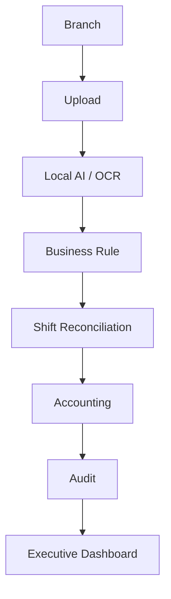

# 25. Production Readiness & Go-Live

## Objective

This document defines production readiness for D-FARM Pay-in AI before organization-wide go-live.

Target users and scale:

- 100+ branches
- 200+ Accounting users
- Audit team
- Regional Managers
- Executive dashboard users
- 500+ concurrent users
- 10,000,000+ records over time

Only local/free AI components are supported:

- Ollama
- PaddleOCR
- OpenCV

The system must not depend on OpenAI, Gemini, Claude, or any paid AI API.

## Production Architecture

## Environments

Supported environments:

- Development
- Testing
- UAT
- Production

Configuration must be separated by environment and must not require source code changes.

Recommended configuration sources:

- `.env` for build/runtime values
- Firestore `systemConfigurations` for admin-managed values
- Secret manager for production credentials
- Runtime provider configuration for Ollama, PaddleOCR, and OpenCV endpoints

## Go-Live Checklist

Go-live must pass:

- 100% Critical Test
- 95% Overall Test

Checklist areas:

| Area | Required |
|---|---|
| AI Provider | Yes |
| OCR Provider | Yes |
| Database | Yes |
| Storage | Yes |
| Queue | Yes |
| Worker | Yes |
| Workflow | Yes |
| Notification | Yes |
| Backup | Yes |
| Security | Yes |

The Production Readiness Dashboard records pass/fail evidence and actor for each checklist item.

## System Check Before Go-Live

Before each launch or major release, Admin must check:

- AI Provider
- OCR Provider
- Database
- Storage
- Worker
- Queue
- Backup
- Notification
- Workflow
- Security

Any failed critical item blocks go-live.

## UAT

UAT module supports:

- Create Test Case
- Run Test
- Approve
- Reject
- Comment

UAT categories:

- Branch Upload
- OCR
- AI
- Pay-in
- Shift Report
- Shift Reconciliation
- Workflow
- Accounting
- Audit
- Dashboard
- Notification
- Performance

UAT approval target:

- Critical scenarios: 100%
- Overall scenarios: 95% or above

## Performance Test

Required performance scenarios:

- 100+ branches
- 500+ concurrent users
- 100,000+ documents
- Load Test
- Stress Test

Minimum metrics:

- Average response time
- P95 response time
- Error rate
- Queue waiting time
- Worker processing time
- OCR processing time
- AI processing time

Performance testing should use generated test data and must not alter real production data.

## Security Test

Security tests:

- Permission
- Authentication
- Authorization
- Session Timeout
- Role
- Branch Isolation
- Audit Log

Required result:

- All critical security tests must pass.
- Branch users must only see their branch.
- Executive users must remain read-only.
- Every admin and workflow action must write an audit log.

## Training Mode

Training Mode uses simulated data and must not affect real production data.

Supported roles:

- Branch
- Accounting
- Audit

Training Mode rules:

1. Clearly mark the environment as training.
2. Use demo records only.
3. Disable production exports.
4. Do not write to production Firestore or production Storage.
5. Keep training audit logs separate from production audit logs.

## Deployment Guide

### Docker

Recommended container layout:

- Web app container
- API container
- Worker container
- Ollama container or local host service
- PaddleOCR service
- OpenCV service

### Docker Compose

Recommended services:

- `web`
- `api`
- `worker`
- `ollama`
- `paddleocr`
- `opencv`

Use mounted volumes for model data, OCR server data, logs, and backups.

### Linux / Ubuntu

1. Install Node.js LTS.
2. Install Ollama.
3. Pull the approved vision model.
4. Install Python runtime for PaddleOCR and OpenCV servers.
5. Configure environment variables.
6. Build the web app.
7. Start services with systemd or container runtime.
8. Verify health checks.

### Windows Server

1. Install Node.js LTS.
2. Install Ollama for Windows or run Ollama on a separate Linux host.
3. Install Python for PaddleOCR and OpenCV local services.
4. Configure service startup.
5. Configure firewall rules for local service endpoints.
6. Run production build.
7. Verify Admin Console health.

## Standard Operating Procedure

### Branch SOP

1. Login.
2. Upload POS Summary, Pay-in, transfer slip, MaeManee, CRM, and debtor documents.
3. Submit by shift.
4. Monitor workflow status.
5. Respond to returned cases.
6. Upload additional documents when requested.

### Accounting SOP

1. Open Document Inbox.
2. Review validation, duplicate, and risk results.
3. Review Shift Reconciliation.
4. Add comments when needed.
5. Approve, return, reject, or mark high risk.
6. Monitor workflow and SLA.

### Audit SOP

1. Review high-risk cases.
2. Inspect audit history and workflow timeline.
3. Lock case if investigation is required.
4. Assign investigation.
5. Reopen or complete cases as appropriate.

### Regional Manager SOP

1. Open assigned regional workflow.
2. Review escalated branch issues.
3. Approve, reject, or assign further investigation.

### Executive SOP

1. Open dashboard.
2. Review branch risk, system readiness, and production status.
3. Do not alter operational cases.

## Manuals

Required manuals:

- User Manual
- Administrator Manual
- System Manual
- Troubleshooting Guide

Each feature must have:

- Purpose
- Required role
- Step-by-step operation
- Expected result
- Common errors
- Escalation path

## Monitoring

Real-time monitoring covers:

- System Status
- Queue Status
- Worker Status
- AI Status
- OCR Status
- Database Status
- Storage Status
- Backup Status

Monitoring must include warning and critical thresholds.

## Logging

Required log categories:

- Application Log
- System Log
- Security Log
- AI Log
- OCR Log
- Workflow Log

Logs must include:

- Log ID
- Type
- Level
- Message
- Context
- Actor when available
- Created date/time

## Backup Verification

Before go-live:

1. Create backup.
2. Verify backup file or backup metadata.
3. Run restore drill in non-production environment.
4. Verify workflow history.
5. Verify audit logs.
6. Verify document metadata.
7. Verify storage files.
8. Record result in readiness dashboard.

## Rollback

Every workflow and deployment must support rollback.

Rollback plan:

- Preserve previous build artifact.
- Preserve database backup.
- Preserve storage snapshot.
- Stop workers.
- Drain or pause queues.
- Restore last known good configuration.
- Run health check.
- Resume queues and workers.

## Error Handling, Retry, and Health

Every module must support:

- Error handling
- Logging
- Retry
- Health check
- Admin visibility

Background jobs must support:

- Pause
- Resume
- Retry
- Monitor
- Dead Letter Queue

## Troubleshooting

### AI Offline

1. Check Ollama service.
2. Check model is available.
3. Switch provider to mock only for test/training if needed.
4. Review AI logs.

### OCR Offline

1. Check PaddleOCR service.
2. Check endpoint configuration.
3. Verify local Python server.
4. Review OCR logs.

### Queue Backlog

1. Check worker status.
2. Check dead letter queue.
3. Pause low-priority export/report queues.
4. Scale workers.

### Backup Failed

1. Check storage access.
2. Check disk capacity.
3. Run manual backup.
4. Escalate to Admin and IT.

### Branch Cannot See Record

1. Verify branch assignment.
2. Verify role.
3. Check branch isolation rule.
4. Check audit log.

## Acceptance Criteria

The system is ready when:

- 100% critical checklist items pass.
- 95% overall checklist items pass.
- UAT critical cases pass.
- Security critical cases pass.
- Performance target is accepted.
- Backup and restore verification is complete.
- Admin Console health is OK or approved with documented exception.
- Training Mode is disabled for production.

## Go-Live Decision

The system can go live only after:

1. Admin confirms readiness dashboard.
2. Accounting confirms UAT.
3. Audit confirms security and audit log coverage.
4. IT confirms backup and disaster recovery.
5. Executive approves production launch.
