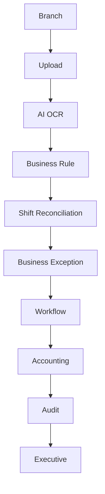

# 26. Version 1.0 Release

## Release Note

Version: `1.0.0`

D-FARM Pay-in AI Version 1.0 is prepared as an Enterprise Financial Document Intelligence Platform for production operations across 100+ branches.

Supported local/free AI components:

- Ollama
- PaddleOCR
- OpenCV

Unsupported providers:

- OpenAI
- Gemini
- Claude
- Paid AI APIs

## Architecture

Business logic is separated from AI, workflow, database, and storage. New document types, workflow types, and AI providers can be added through interfaces and configuration without changing core business logic.

## Operations Center

Operations Center provides one enterprise command view:

- System Health
- Workflow
- AI
- OCR
- Queue
- Worker
- Database
- Storage
- Notification
- Performance
- Backup

It uses current operational records, workflow cases, platform status, and audit trail already in the system.

## Dashboard Guide

### Executive Dashboard

Shows:

- Company Overview
- Branch Overview
- Today's Summary
- Pending Cases
- Critical Cases
- Risk Summary
- Document Summary
- AI Accuracy
- OCR Accuracy
- Workflow SLA

### Regional Dashboard

Regional Managers see only data for their own region.

### Branch Dashboard

Branch users see:

- Pending
- Rejected
- Returned
- Approved
- Submission status

### Accounting Dashboard

Accounting users see:

- My Task
- Waiting Review
- Over SLA
- High Risk
- Completed Today

### Audit Dashboard

Audit users see:

- Open Investigation
- Critical Branch
- Manual Override
- High Risk Trend
- History

### KPI Dashboard

KPI sections:

- Branch KPI
- Accounting KPI
- Audit KPI
- AI KPI
- OCR KPI
- Workflow KPI

## Branch Scorecard

Branch scorecard calculates:

- Document Completeness
- Submission Time
- Difference Rate
- Manual Correction Rate
- AI Accuracy
- Overall Branch Score

Scorecards are intended to prioritize operational support, not to accuse a branch of fraud.

## Analytics

Supported periods:

- Daily
- Weekly
- Monthly
- Quarterly
- Yearly

Analytics should be precomputed for production at large scale.

## Report Center

Supported reports:

- Daily Report
- Branch Report
- Accounting Report
- Audit Report
- Executive Report
- Risk Report

Supported export formats:

- PDF
- Excel
- CSV

The current application exports spreadsheet data through XLSX. PDF and CSV are release-ready design targets.

## Enterprise Search

Search covers:

- Branch
- Business Date
- Shift
- Case
- Reference
- Document
- Workflow
- Risk

Production search should use indexed queries or a dedicated search service when the dataset grows beyond normal Firestore query patterns.

## Announcement Center

Admin can publish:

- News
- Maintenance notices
- Policy updates
- Notifications

Announcements must be audited.

## System Maintenance

Supported modes:

- Maintenance Mode
- Read Only Mode
- Emergency Mode

Maintenance actions must be restricted to Admin and recorded in audit logs.

## License

Enterprise license supports:

- Enterprise License
- Future Expansion
- Branch and user capacity
- Document capacity

Version 1.0 license target:

- 500 branches
- 1,000 users
- 10,000,000 documents

## API Guide

Version 1.0 prepares REST API design with:

- Versioning
- API Key
- Future Integration

Planned APIs:

- `/api/v1/payin-records`
- `/api/v1/workflow-cases`
- `/api/v1/reports/branches`
- `/api/v1/reports/risk`

Future integration targets:

- POS API
- ERP
- SAP
- Microsoft Dynamics
- Power BI
- Microsoft 365

## Performance

Tracked metrics:

- Response Time
- System Load
- Queue Time
- OCR Time
- AI Time
- Workflow Time

Performance targets:

- 100+ branches
- 500+ concurrent users
- 1,000+ users
- 10,000,000+ documents

## Monitoring

Monitoring covers:

- Real-time status
- Alert
- Log
- Health
- Backup
- Recovery

Critical services should have alert thresholds and escalation rules.

## Audit Trail

Audit trail stores every event:

- Upload
- AI/OCR result
- Validation
- Workflow transition
- Accounting action
- Audit action
- Admin configuration
- Announcement
- Maintenance mode
- Export

Audit logs are immutable and should be queryable by branch, date, actor, and action.

## Admin Guide

Admin is responsible for:

1. Go-live readiness.
2. System configuration.
3. User and branch management.
4. Announcement publishing.
5. Maintenance mode.
6. Backup verification.
7. Queue and worker monitoring.
8. Provider configuration.
9. Release approval.

## Operation Guide

Daily operation:

1. Review Operations Center health.
2. Check queue and worker backlog.
3. Review pending and critical cases.
4. Review branch scorecards.
5. Review audit alerts.
6. Confirm backup status.
7. Publish announcements if required.

## Scalability Guide

For enterprise scale:

- Use pagination everywhere.
- Use lazy loading for documents.
- Store file metadata in database and actual files in storage.
- Use background jobs for OCR/AI/validation/risk/report.
- Precompute dashboards.
- Archive old documents and logs.
- Partition high-volume collections by date.
- Index branchCode, businessDate, shift, status, riskLevel, workflowStatus, and createdAt.

## Version 1.0 Final Deliverable

The system supports:

- Real operation for 100+ branches.
- Large operational datasets.
- Shift-based financial document checking.
- Local AI document reading.
- Business rule total validation.
- Accounting review.
- Internal Audit review.
- Enterprise workflow.
- Operations monitoring.
- Future integration and expansion.

## Release Acceptance

Before Version 1.0 release:

1. Build must pass.
2. Critical smoke tests must pass.
3. Go-live readiness must be reviewed.
4. Operations Center must display live application data.
5. Admin must verify backup and rollback plan.
6. Accounting and Audit must approve operating SOP.
7. Executive must approve release readiness.
