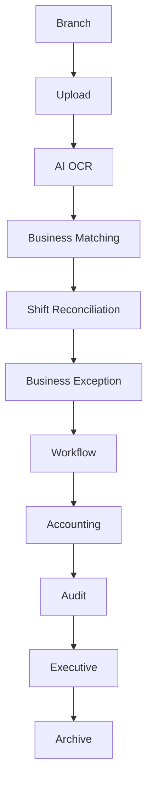

# 27. Enterprise Launch & Continuous Improvement

## Objective

Sprint 29 prepares D-FARM Pay-in AI for enterprise launch and continuous improvement without changing the core architecture.

Target scale:

- 100+ branches
- 500+ concurrent users
- Millions of documents
- Future growth to 1,000+ branches

Supported local/free AI stack:

- Ollama
- PaddleOCR
- OpenCV

Not allowed:

- OpenAI
- Gemini
- Claude
- Paid AI APIs

## Launch Checklist

Launch Center verifies:

- System Status
- AI Status
- OCR Status
- Workflow
- Database
- Storage
- Queue
- Worker
- Backup
- Health

Launch is ready only when critical platform and production readiness checks are green.

## Architecture

Business logic remains separate from AI, workflow, database, storage, and archive.

## Continuous Improvement

Improvement Center tracks:

- AI Accuracy
- OCR Accuracy
- Business Exception
- Manual Correction
- False Positive
- False Negative
- Workflow KPI
- Branch KPI

These metrics guide process improvement and model tuning. They must not be used as a fraud verdict.

## AI Learning Center

AI Learning Center collects:

- Correction History
- Manual Override
- False Positive
- OCR Failure
- Low Confidence
- Business Exception
- Training Dataset

Training datasets must be reviewed before being used by a local provider.

## Business Rules

Business Rule Center allows Admin to:

- Add business rule
- Edit business rule
- Disable business rule

No source code change should be required for business rule changes. Every change must create an audit log.

## Workflow

Workflow remains configurable and independent from business logic.

Future workflow additions should not require changing core architecture:

- New approval step
- New investigation process
- New document request flow
- New regional escalation

## Template Manager

Template Manager supports:

- Shift Report
- Pay-in
- Bank Transfer
- MaeManee
- CRM
- Debtor
- Future Document

Template changes must be versioned and audited.

## AI Provider Manager

Provider Manager supports:

- AI Provider
- OCR Provider
- Vision Provider

Providers can be added or disabled without changing business logic. Providers must remain local/free unless policy changes in the future.

## Configuration Center

Configuration Center manages:

- System Configuration
- Workflow
- Risk
- Queue
- Notification
- Retention
- Storage

Production configuration should be versioned and environment-specific.

## Retention

Retention policy supports:

- 1 year
- 2 years
- 5 years
- Permanent

Retention can be configured for:

- Images
- OCR results
- AI results
- Audit logs
- Correction history

## Archive

Archive supports:

- Archive
- Restore
- Document Version

Archived files must keep metadata and audit history.

## Monitoring

Monitoring covers:

- Real-time health
- Queue
- Worker
- Storage
- OCR
- AI
- Database
- Network

Every service should support monitoring, logging, retry, and recovery.

## Security

Security readiness:

- Two Factor Ready
- SSO Ready
- Active Directory Ready
- Future Microsoft Entra ID Ready

Every configuration, permission, workflow, business rule, and AI provider change must create an audit log.

## API Gateway Ready

Future integration targets:

- REST API
- Webhook
- ERP Integration
- POS Integration
- SAP Integration
- Power BI Integration

API versioning and API keys are required before external integration.

## Automatic Maintenance

Automatic maintenance supports:

- Auto Cleanup
- Auto Archive
- Auto Backup
- Auto Health Check
- Auto Queue Recovery

Admin must be able to monitor and override maintenance tasks.

## Backup

Backup requirements:

- Daily backup
- Restore drill
- Disaster recovery checklist
- Archive recovery
- Audit log preservation

## Roadmap

Version 1.0:

- Local AI/OCR
- Shift reconciliation
- Workflow
- Risk and exception analytics
- Operations Center
- Launch Center

Version 2.0:

- Real production API layer
- Dedicated worker services
- External enterprise identity integration
- Advanced reporting
- Power BI integration
- Additional document types
- More local AI providers

## Testing

Required checks:

- Build
- Lint
- Unit Test
- Integration Test
- Smoke Test
- Health Check

Current project has build and smoke test coverage. Lint and formal test scripts should be added before hard production gate.

## Final Deliverable

Version 1.0 Enterprise Ready supports:

- Real usage
- 100+ branches
- Millions of records
- Future expansion
- Version 2.0 development

The system is designed as an Enterprise Financial Operations Platform that can add document types, workflows, business rules, AI providers, and OCR providers without changing core architecture.
