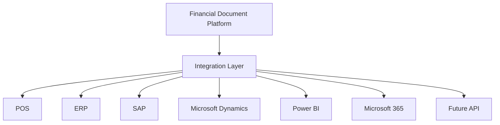

# 29. Enterprise Integration Platform

## Objective

Enterprise Integration Platform separates external-system connectivity from D-FARM Financial Document Platform business logic.

Business logic must not know POS, ERP, Power BI, Microsoft 365, or future external systems directly. All external communication goes through the Integration Layer.

Supported local/free AI stack remains:

- Ollama
- PaddleOCR
- OpenCV

Disallowed:

- OpenAI
- Gemini
- Claude
- Paid AI APIs

## Architecture

## Module

Folder: `src/integration/`

Files:

- `IntegrationService.js`
- `IntegrationEngine.js`
- `IntegrationRepository.js`
- `IntegrationScheduler.js`
- `IntegrationLogService.js`
- `WebhookService.js`
- `ApiGatewayService.js`
- `ConnectorManager.js`

## Entity: IntegrationJob

| Field | Description |
|---|---|
| jobId | Unique integration job id |
| integrationType | REST_API, WEBHOOK, SCHEDULED_SYNC, FUTURE_MESSAGE_QUEUE |
| sourceSystem | Source system name |
| destinationSystem | Destination system name |
| status | QUEUED, SUCCESS, FAILED, DEAD_LETTER |
| retryCount | Retry count |
| startedAt | Start time |
| finishedAt | Finish time |
| createdAt | Created time |

## Supported Integration Types

- REST API
- Webhook
- Scheduled Sync
- Future Message Queue

## API Versioning

Supported API versions:

- v1
- v2
- future

Versioning must be explicit per connector and per API key.

## Connectors

Supported connector templates:

- POS
- ERP
- SAP
- Microsoft Dynamics
- Power BI
- Microsoft 365
- Future Connector

Admin can enable, disable, configure endpoint, and configure schedule without source code changes.

## Synchronization

Supported modes:

- Manual
- Scheduled
- Realtime (future)

Scheduled sync should run through the integration scheduler and create an `IntegrationJob`.

## Webhook

Webhook service supports:

- Incoming webhook
- Outgoing webhook
- Retry
- Log

Webhook calls are represented as integration jobs and logged in Integration Log.

## API Gateway

API Gateway supports:

- Multiple API keys
- Rotate key
- Expire key
- Permission

Security ready:

- API Key
- JWT
- IP Whitelist Ready
- Rate Limit Ready

## Retry

Retry policy:

- Auto retry up to 3 times
- Failed jobs can be retried manually
- Jobs exceeding retry limit move to Dead Letter Queue
- Every retry is logged

## Integration Dashboard

Dashboard shows:

- Success
- Fail
- Retry
- Queue
- Latency
- Last Sync
- Dead Letter Queue

## Integration Log

Each log stores:

- Request
- Response
- Status
- Duration
- Error
- Retry
- Created time

## Monitoring

Monitoring covers:

- Connector status
- Job queue
- Retry count
- Dead letter queue
- API key status
- Webhook status
- Schedule status
- Latency
- Failure rate

## Security

Security rules:

1. External systems access only Integration Layer.
2. Business logic never calls ERP/POS/Power BI directly.
3. API keys must be rotatable.
4. Expired keys must not be accepted in production.
5. IP whitelist and rate limit are design-ready.
6. Every integration action creates audit log.

## Configuration

Admin can configure:

- Enable connector
- Disable connector
- Endpoint
- Schedule
- API version
- API key
- Permission

Configuration is stored outside business logic and can move from localStorage mock to Firestore/secure configuration storage later.

## Notification

Notification scenarios:

- Integration Fail
- Retry
- API Down
- Dead Letter Queue created
- Connector disabled

Current implementation prepares metadata and audit integration. Production should connect this to the platform notification queue.

## Performance

Targets:

- 100+ branches
- 500+ concurrent users
- Millions of API calls
- Millions of transactions

Performance rules:

- Use background jobs for outbound sync.
- Avoid blocking UI on external calls.
- Batch high-volume report exports.
- Use pagination for logs.
- Precompute analytics for Power BI and executive reporting.

## Scalability

New connectors must be added without changing Integration Engine.

Connector-specific logic should live in connector configuration or a connector adapter, not in business modules.

## Audit

Audit log required for:

- Connector enable/disable
- Connector endpoint change
- Schedule change
- API key create/rotate/expire
- Manual sync
- Webhook simulation or receipt
- Retry
- Dead letter movement

## Future Integrations

Future-ready targets:

- POS API
- ERP
- SAP
- Microsoft Dynamics
- Power BI
- Microsoft 365
- Webhooks
- Message queue

## Production Notes

Current implementation is local/mock integration architecture. Production should replace the local repository with secure backend storage, API key hashing, rate limiting, IP whitelist enforcement, and server-side webhook validation.
