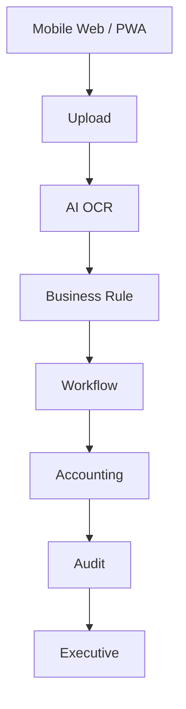

# 30. Mobile Operations Platform

## Objective

Mobile Operations Platform enables D-FARM Pay-in AI to be used from mobile browsers across Branch, Accounting, Audit, Regional Manager, and Executive roles.

No native Android or iOS app is required. The web application is the primary mobile platform.

Supported local/free AI stack:

- Ollama
- PaddleOCR
- OpenCV

Disallowed:

- OpenAI
- Gemini
- Claude
- Paid AI APIs

## Architecture



Mobile uses the same business logic as desktop. It does not duplicate reconciliation, workflow, risk, or validation logic.

## Module

Folder: `src/mobile/`

Files:

- `MobileLayout.js`
- `MobileDashboard.js`
- `MobileUpload.js`
- `MobileWorkflow.js`
- `MobileReview.js`
- `MobileNotification.js`
- `OfflineService.js`

## Responsive Design

Supported targets:

- Android
- iPhone
- Tablet
- Desktop
- PWA-ready browser

UI rules:

- Large buttons
- Readable text
- One-hand operation
- Mobile-first upload area
- Responsive dashboard cards
- Simple search
- Lazy document preview

## Branch Mobile

Branch mobile supports:

- Upload
- Camera
- Gallery
- PDF
- Multiple images
- Compress image flag
- Preview
- Retry upload
- Offline upload queue

## Camera

Browser camera is opened through file input:

```html
<input type="file" accept="image/*,.pdf" capture="environment" multiple>
```

Camera readiness:

- Auto Crop ready
- Auto Rotate ready
- Image Quality Check ready
- Blur Detection ready
- Low Light Detection ready
- Duplicate Detection ready

Current implementation performs local metadata and quality checks. Production can replace this with OpenCV preprocessing before upload.

## Offline Mode

Offline mode supports:

- Offline Upload Queue
- Auto Sync ready
- Conflict Detection
- Retry

Offline queue stores upload metadata locally. Production should encrypt local storage or use IndexedDB for larger payload metadata.

Conflict detection checks branch, business date, and shift to warn about duplicate offline submissions.

## Accounting Mobile

Accounting mobile supports:

- Pending Review
- Approve ready
- Reject ready
- Return ready
- Comment ready
- Search

Actions should use the same accounting review services used by desktop.

## Audit Mobile

Audit mobile supports:

- Risk
- Exception
- Branch History
- Document
- Comment
- Assign Investigation ready

Audit views remain role-protected.

## Regional Manager

Regional Manager sees only cases and branch data for their region.

## Executive Mobile

Executive mobile supports:

- Dashboard
- KPI
- Risk
- Branch Ranking
- Pending
- Critical

Executive mode is read-only.

## Notification Center

Supported:

- In App
- Push Notification ready

Future:

- LINE
- Microsoft Teams
- Email

## Dashboard

Mobile dashboard shows:

- Today
- Pending
- Rejected
- Returned
- Completed
- High Risk
- Workflow pending

## Quick Actions

Quick action buttons:

- Upload
- Review
- Approve
- Reject
- Search
- Notification

## Search

Mobile search supports:

- Branch
- Business Date
- Shift
- Reference
- Document
- Workflow

## Performance

Mobile performance design:

- Lazy Loading
- Image Cache ready
- Compression flag for files over 2MB
- Background Upload ready
- Offline Queue
- Retry

Production should move large offline storage from localStorage to IndexedDB.

## Security

Mobile security readiness:

- Biometric ready
- PIN ready
- JWT ready
- Session Timeout
- Device Logging ready

Production should log device metadata and session metadata for mobile users.

## PWA

PWA support:

- Install to Home Screen
- Offline Cache
- Background Sync ready
- App Manifest
- Service Worker

Files:

- `public/manifest.webmanifest`
- `public/sw.js`
- `public/pwa-icon.svg`

## Accessibility

Accessibility targets:

- Large Font
- Dark Mode ready
- Light Mode
- High contrast readable cards
- Buttons sized for touch

## Scalability

Target:

- 100+ branches
- 500+ concurrent mobile users

Rules:

1. Do not load all records on mobile.
2. Use pagination and filtering.
3. Keep images lazy-loaded and compressed.
4. Use background upload and retry.
5. Share business logic with desktop services.

## Production Notes

The current implementation is browser-first PWA-ready architecture. It does not require native Android or iOS development.

Future hardening:

- IndexedDB offline queue
- Encrypted local metadata
- Push notification service
- Background Sync API
- Device logging service
- Biometric/PIN integration through enterprise identity provider
