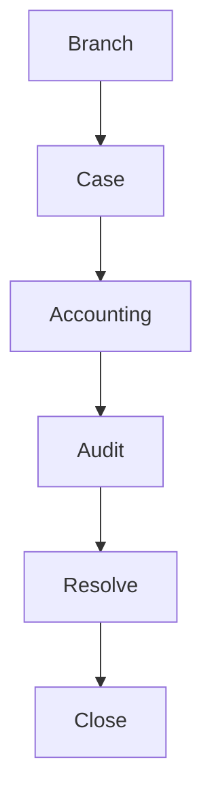

# 31. Branch Communication & Case Management

## Objective

Case Management provides one communication channel for Branch, Accounting, Audit, and Regional Manager.

Goal:

- Reduce LINE usage
- Reduce phone calls
- Reduce email dependency
- Keep every action in system history and audit log

Supported local/free AI stack remains:

- Ollama
- PaddleOCR
- OpenCV

Disallowed:

- OpenAI
- Gemini
- Claude
- Paid AI APIs

## Architecture

Case management is separate from workflow and business logic. A case can reference branch, business date, shift, document, and workflow, but it does not replace the financial validation workflow.

## Module

Folder: `src/case-management/`

Files:

- `CaseService.js`
- `CaseRepository.js`
- `CaseWorkflow.js`
- `CaseCommentService.js`
- `CaseAttachmentService.js`
- `CaseNotificationService.js`
- `CaseAssignmentService.js`

## Entity: Case

| Field | Description |
|---|---|
| caseId | Unique case id |
| branchCode | Branch code |
| businessDate | Business date |
| shift | Shift |
| caseType | Case type |
| priority | LOW, NORMAL, HIGH, URGENT, CRITICAL |
| status | OPEN, WAITING_BRANCH, WAITING_ACCOUNTING, WAITING_AUDIT, IN_PROGRESS, RESOLVED, CLOSED |
| riskScore | Related risk score |
| assignedRole | Current owner role |
| assignedUser | Current owner user |
| createdAt | Created datetime |
| updatedAt | Updated datetime |
| closedAt | Closed datetime |

## Case Type

- Missing Document
- Wrong Amount
- OCR Error
- AI Review
- Manual Review
- Accounting Request
- Audit Investigation
- General

## Case Status

- OPEN
- WAITING_BRANCH
- WAITING_ACCOUNTING
- WAITING_AUDIT
- IN_PROGRESS
- RESOLVED
- CLOSED

## Workflow

Typical flow:

1. Branch or Accounting creates a case.
2. Accounting requests document or reviews the case.
3. Branch replies, comments, or uploads additional document.
4. Accounting approves, rejects, returns, or assigns.
5. Audit can investigate, lock, unlock, comment, or override.
6. Regional Manager can resolve escalated cases.
7. Admin can close cases.

## Comment

Supported comment creators:

- Accounting
- Branch
- Audit
- Regional Manager
- Admin

Comment types:

- Public
- Internal
- System

Every comment stores:

- commentId
- commentType
- text
- createdBy
- createdRole
- createdAt

## Timeline

Case timeline records:

- Upload
- OCR
- AI
- Comment
- Assignment
- Return
- Approve
- Reject
- Resolve
- Close

Every status change appends timeline history.

## Attachment

Supported attachment metadata:

- Image
- PDF
- Excel
- ZIP

Branch can send additional documents without creating a new case.

Production storage should keep actual files in object storage and only metadata in database.

## SLA

SLA supports:

- Response Time
- Resolution Time
- Overdue

Default mock SLA:

- responseDueDate: 60 minutes
- resolutionDueDate: 240 minutes

Production SLA should be configurable by priority, case type, role, and branch policy.

## Escalation

If SLA is exceeded:

- Escalate to Regional Manager
- Escalate to Audit for critical risk cases
- Notify assigned role
- Record escalation in audit log

## Dashboard

Case dashboard shows:

- My Cases
- Open Cases
- Waiting Branch
- Waiting Accounting
- Waiting Audit
- Over SLA
- Resolved Today

## Search

Search fields:

- Branch
- Business Date
- Shift
- Case ID
- Reference
- Document
- Status
- Priority
- Assigned User

## Permission

| Role | Permission |
|---|---|
| Branch | Own branch cases, reply, upload document, view history |
| Accounting | Request more document, return, approve, reject, assign, comment |
| Audit | Assign investigation, lock, unlock, comment, override |
| Regional Manager | Region cases and escalations |
| Admin | All cases and close case |
| Executive | Read-only overview |

## Audit Log

Every action must create audit log:

- Create case
- Comment
- Attachment
- Assignment
- Status change
- Return
- Approve
- Reject
- Resolve
- Close
- Lock / Unlock
- Override

## Scalability

Target:

- 100+ branches
- 500+ concurrent users
- Millions of cases

Scalability requirements:

- Pagination
- Lazy loading
- Indexed query by branch, date, status, priority, assigned user
- Background notification
- Attachment metadata in database, file in storage

## Important Rules

1. Every case must reference branch, business date, and shift.
2. Every comment must have timestamp and creator.
3. Every change must create audit log.
4. Additional documents can be sent in the same case.
5. Business logic is separate from workflow and case communication.
6. Case management must scale to enterprise operations.
