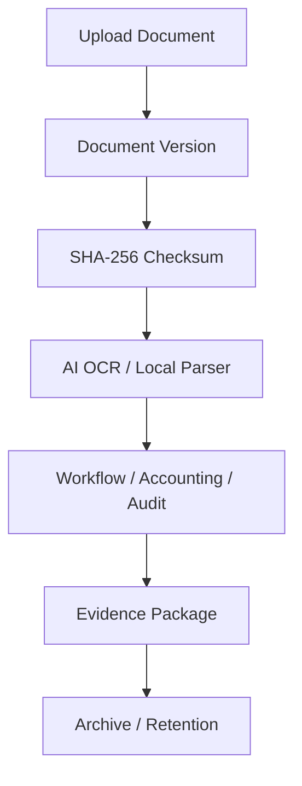

# Sprint 34: Document Version Control & Evidence Management

## Objective

ระบบ Document Version Control และ Evidence Management ใช้รองรับการตรวจสอบย้อนหลัง การแก้ไขเอกสาร และการเก็บหลักฐานระดับองค์กร โดยไม่แก้ไขไฟล์เดิมโดยตรง ทุกครั้งที่มีการแทนที่หรือแก้ไขไฟล์ต้องสร้าง Document Version ใหม่เสมอ

ระบบยังคงยึดหลัก Local AI เท่านั้น:

- Ollama
- PaddleOCR
- OpenCV
- Mock fallback

ห้ามผูก Business Logic กับ OpenAI, Gemini, Claude หรือ paid API

## Architecture

## Module

สร้างโมดูล `src/document-version/`

- `DocumentVersionService.js`
- `DocumentRepository.js`
- `DocumentHistoryService.js`
- `DocumentCompareService.js`
- `EvidenceManager.js`
- `RetentionPolicyService.js`
- `index.js`

Repository ใช้ mock/localStorage ก่อน แต่แยก interface ให้เปลี่ยนเป็น Firestore ได้ภายหลัง

## Entity: Document

| Field | Description |
| --- | --- |
| documentId | รหัสเอกสารหลัก |
| branchCode | สาขา |
| businessDate | วันที่ขาย |
| shift | กะ |
| documentType | ประเภทเอกสาร |
| currentVersion | version ปัจจุบัน |
| status | ACTIVE, DUPLICATE_REVIEW, ARCHIVED |
| createdAt | เวลาสร้าง |
| updatedAt | เวลาแก้ไขล่าสุด |

## Entity: DocumentVersion

| Field | Description |
| --- | --- |
| versionId | รหัส version |
| documentId | อ้างอิงเอกสารหลัก |
| versionNumber | เลข version เริ่มจาก 1 และเพิ่มไม่จำกัด |
| fileName | ชื่อไฟล์ |
| fileType | ประเภทไฟล์ |
| fileSize | ขนาดไฟล์ |
| uploadedBy | ผู้อัปโหลด |
| uploadedAt | เวลาอัปโหลด |
| ocrResultId | อ้างอิง OCR result |
| aiResultId | อ้างอิง AI result |
| checksum | SHA-256 checksum |
| isCurrent | เป็น version ปัจจุบันหรือไม่ |
| changeReason | เหตุผลการเปลี่ยน |

## Document Type

- Shift Report
- Pay-in
- Bank Transfer
- MaeManee
- CRM
- Debtor Transfer
- Supporting Document
- Other

## Version Control Rule

1. ห้ามแก้ไขไฟล์เดิม
2. เมื่อมีการอัปโหลดแทนที่ ต้องสร้าง version ใหม่
3. Version number เพิ่มต่อเนื่องและไม่จำกัดจำนวน
4. Version เก่าต้องยังดูย้อนหลังได้
5. Restore version ต้องเปลี่ยน `currentVersion` และสร้าง audit log
6. Comment version ต้องเก็บผู้สร้าง เวลา และข้อความ

## Evidence Management

ทุกเอกสารต้องรวบรวมข้อมูลหลักฐานต่อไปนี้:

- Original File
- Thumbnail
- OCR Result
- AI Result
- Correction History
- Workflow History
- Audit Log
- Version Timeline

Evidence Package ใช้สำหรับ Audit, Regional Manager, Executive และการตรวจสอบย้อนหลัง

## Checksum

ทุก version ต้องสร้าง SHA-256 checksum เพื่อ:

- ตรวจสอบ file integrity
- ตรวจสอบไฟล์เสีย
- ตรวจสอบไฟล์ถูกแก้ไข
- ใช้ประกอบ duplicate detection

## Duplicate Detection

ระบบตรวจซ้ำจาก:

- Checksum
- Image hash จาก pipeline เดิม
- Reference number จากเอกสาร

ถ้าพบซ้ำให้เพิ่ม risk flag:

- `DUPLICATE_DOCUMENT`

สถานะเอกสารสามารถเป็น `DUPLICATE_REVIEW` เพื่อส่งให้ Accounting/Audit ตรวจเพิ่ม

## Document Compare

การเปรียบเทียบ version ต้องแสดง:

- File Difference
- OCR Difference
- AI Difference
- Field Difference

ใช้เพื่อดูว่าไฟล์ใหม่ต่างจากไฟล์เดิมอย่างไร และมีผลต่อข้อมูลที่ AI/OCR อ่านหรือไม่

## Permission

| Role | Permission |
| --- | --- |
| Branch | ดูเฉพาะเอกสารของสาขาตัวเอง |
| Accounting | ดูตามสิทธิ์, restore, comment, archive |
| Audit | ดู version history และ timeline ทั้งหมด |
| Admin | จัดการทั้งหมดและตั้งค่า retention |
| Executive | อ่านข้อมูลตามสิทธิ์ |

## Retention Policy

รองรับระยะเวลาเก็บเอกสาร:

- 1 ปี
- 2 ปี
- 5 ปี
- 7 ปี
- 10 ปี
- ถาวร

ตั้งค่าแยกได้สำหรับ:

- Document Retention
- Evidence Retention
- Audit Retention

## Archive

รองรับ:

- Archive
- Restore
- Export Evidence

การ Archive ไม่ลบข้อมูล และต้องเก็บ history/audit log เสมอ

## Search

ค้นหาได้จาก:

- Document ID
- Reference
- Branch
- Business Date
- Shift
- Document Type
- Uploader
- Version

## Dashboard

Widget หลัก:

- Document Today
- Version Created
- Duplicate
- Archive
- Storage Usage

## Scalability

ออกแบบเพื่อรองรับ:

- 100+ branches
- 500+ concurrent users
- 10,000,000+ documents
- 100,000,000+ versions

ข้อกำหนดด้าน performance:

- ใช้ pagination / lazy loading
- โหลด thumbnail ก่อน original file
- เก็บ metadata ใน database
- ไฟล์จริงอยู่ใน Storage
- รองรับ streaming download ใน production

## Security

- File Integrity ด้วย checksum
- Permission ตาม role และ branch isolation
- Audit Log ทุก action สำคัญ
- Download Log
- Restore Log
- Archive Log

## Future Firebase Design

เมื่อย้ายจาก mock/localStorage ไป Firestore:

- `documents/{documentId}`
- `documents/{documentId}/versions/{versionId}`
- `documents/{documentId}/events/{eventId}`
- `evidencePackages/{evidenceId}`
- `retentionPolicies/{policyId}`

ไฟล์จริงเก็บใน Firebase Storage:

- `documents/{branchCode}/{businessDate}/{documentId}/v{versionNumber}/original`
- `documents/{branchCode}/{businessDate}/{documentId}/v{versionNumber}/thumbnail`

Business Logic ไม่ต้องรู้ว่า storage เป็น mock หรือ Firebase
