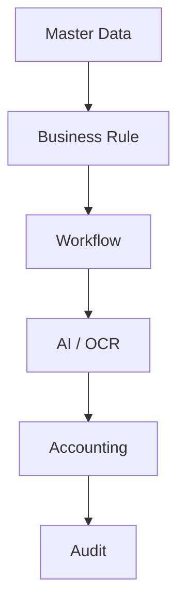

# Sprint 35: Master Data & Branch Administration Center

## Objective

Master Data & Branch Administration Center เป็นศูนย์จัดการข้อมูลหลักและการตั้งค่าระบบสำหรับทุกสาขา เพื่อให้ระบบรองรับ 100+, 500+ และ 1,000+ สาขาได้โดยไม่ต้องแก้ source code

ระบบยังคงใช้เฉพาะ Local/Free AI:

- Ollama
- PaddleOCR
- OpenCV
- Mock fallback

Business Logic ต้องอ่านค่าจาก Master Data ไม่ใช้ค่าที่ hardcode ใน source code

## Architecture

## Module

สร้างโมดูล `src/master-data/`

- `MasterDataRepository.js`
- `MasterDataService.js`
- `BranchService.js`
- `BranchPolicyService.js`
- `BusinessRuleService.js`
- `BankAccountService.js`
- `MerchantService.js`
- `PaymentTypeService.js`
- `HolidayService.js`
- `RegionService.js`
- `index.js`

Repository ใช้ mock/localStorage ก่อน และแยก service layer เพื่อเปลี่ยนเป็น Firestore ภายหลังได้ง่าย

## Entity: Branch

| Field | Description |
| --- | --- |
| branchCode | รหัสสาขา |
| branchName | ชื่อสาขา |
| region | ภาค/เขต/cluster |
| province | จังหวัด |
| status | OPEN, CLOSED |
| openingDate | วันที่เปิดสาขา |
| closingDate | วันที่ปิดสาขา |
| isActive | ใช้งานอยู่หรือไม่ |

## Entity: Branch Policy

| Field | Description |
| --- | --- |
| policyId | รหัส policy |
| branchCode | สาขาที่ใช้ policy |
| morningStart | เวลาเริ่มกะเช้า |
| morningEnd | เวลาจบกะเช้า |
| afternoonStart | เวลาเริ่มกะบ่าย |
| afternoonEnd | เวลาจบกะบ่าย |
| depositPolicy | วิธีฝากเงิน |
| paymentPolicy | วิธีตรวจยอด |
| businessDatePolicy | วิธีคิด business date |
| effectiveDate | วันที่เริ่มมีผล |
| status | ACTIVE, INACTIVE |

## Deposit Policy

รองรับ:

- `EVERY_SHIFT`: ฝากทุกกะ
- `NEXT_DAY`: ฝากวันถัดไป
- `COMBINED_DEPOSIT`: ฝากรวม

กำหนดได้รายสาขา ห้าม hardcode เวลาและวิธีฝากใน business logic

## Business Date Policy

รองรับ:

- `BUSINESS_DATE`
- `CALENDAR_DATE`
- `CROSS_DAY`
- `NIGHT_SHIFT`

ใช้แก้กรณีสาขาที่ปิดกะข้ามวันหรือมีรูปแบบการฝากเงินไม่เหมือนกัน

## Entity: Bank Account

| Field | Description |
| --- | --- |
| accountId | รหัสบัญชี |
| branchCode | สาขา |
| bankName | ธนาคาร |
| accountName | ชื่อบัญชี |
| accountNumberMasked | เลขบัญชีแบบ masked |
| accountType | PAYIN, TRANSFER, MAEMANEE |
| status | ACTIVE, INACTIVE |

## Entity: Merchant

| Field | Description |
| --- | --- |
| merchantId | รหัส merchant |
| branchCode | สาขา |
| merchantType | MAEMANEE, CRM, DEBTOR, FUTURE |
| merchantName | ชื่อ merchant |
| merchantCode | รหัสจาก provider |
| provider | ผู้ให้บริการ |
| status | ACTIVE, INACTIVE |

## Payment Type

รองรับ:

- Cash
- Pay-in
- Bank Transfer
- MaeManee
- CRM
- Debtor Transfer
- Future Payment

Payment Type ต้องกำหนด field mapping และ required document ได้จาก Admin

## Business Rule

Admin สามารถ:

- เพิ่ม rule
- แก้ไข rule
- เปิดใช้งาน
- ปิดใช้งาน

โดยไม่ต้องแก้ source code

## Region

รองรับโครงสร้าง:

- สำนักงานใหญ่
- ภาค
- เขต
- Cluster
- สาขา

Regional Manager เห็นเฉพาะข้อมูลใน region ของตนเอง

## Holiday

กำหนดได้:

- วันหยุด
- วันพิเศษ
- วันปิดสาขา
- วันหยุดเฉพาะสาขา

ใช้ประกอบ workflow, SLA, deposit policy และ business date policy

## Approval Workflow

การแก้ไข Master Data สามารถตั้งค่าให้ต้องผ่าน approval ได้

สถานะ:

- `PENDING`
- `APPROVED`
- `REJECTED`

เมื่อ approve แล้วระบบจึง apply change เข้า collection จริง

## History

ทุกการเปลี่ยนแปลงต้องเก็บ Master Data History:

- collection
- item id
- action
- actor
- actor role
- before/after
- createdAt

## Audit Log

ทุก action สำคัญต้องสร้าง audit log:

- MASTER_DATA_CHANGE_REQUEST
- MASTER_DATA_APPROVE
- MASTER_DATA_REJECT
- MASTER_DATA_IMPORT

## Permission

| Role | Permission |
| --- | --- |
| Admin | จัดการทั้งหมด |
| Accounting | อ่านข้อมูล |
| Audit | อ่านข้อมูลทั้งหมด |
| Regional Manager | ดูเฉพาะ region |
| Branch | ดูข้อมูลของสาขาตนเอง |
| Executive | อ่านภาพรวม |

## Import / Export

รองรับ:

- Excel
- CSV
- PDF data export
- JSON สำหรับ system handover

V1 ใช้ client-side export และ mock import จาก CSV/JSON

## Dashboard

แสดง:

- Branch Summary
- Policy Summary
- Bank Account
- Merchant
- Business Rule
- Pending Approval
- Recent Changes

## Performance

แนวทางรองรับข้อมูลจำนวนมาก:

- Lazy loading
- Pagination
- Cache
- Filter ตาม branch, region, collection
- Firestore index ในอนาคตตาม `branchCode`, `region`, `status`

## Scalability

ออกแบบเพื่อรองรับ:

- 100+ branches
- 500+ branches
- 1,000+ branches

Business Logic ต้องไม่ผูกกับจำนวนสาขาตายตัว

## Future Firestore Collections

- `masterBranches`
- `branchPolicies`
- `bankAccounts`
- `merchants`
- `paymentTypes`
- `businessRules`
- `holidays`
- `regions`
- `masterDataApprovals`
- `masterDataHistory`

ทุก collection ต้องมี audit trail และ permission rule แยกตาม role/region/branch

## Important Rules

1. ห้าม hardcode ข้อมูลสาขา เวลาเปิดปิด บัญชีธนาคาร merchant หรือ business rule
2. ทุกข้อมูลต้องจัดการได้จาก Admin
3. ทุกการแก้ไขต้องมี approval หากเปิดใช้งาน
4. ทุกการแก้ไขต้องสร้าง audit log
5. Business Logic ต้องอ่านค่าจาก Master Data
6. ระบบต้องสามารถส่งมอบให้ IT บริษัทดูแลต่อได้โดยไม่แก้ code
