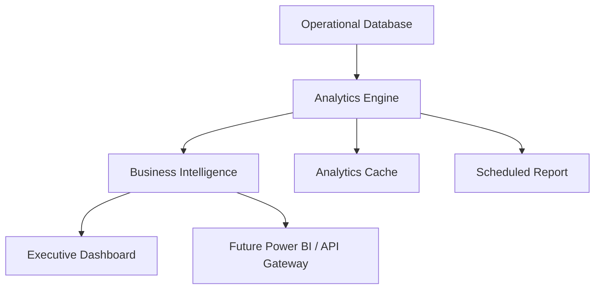

# Sprint 36: Enterprise Business Intelligence & Executive Analytics

## Objective

Enterprise Business Intelligence & Executive Analytics ใช้ช่วยผู้บริหาร, Accounting, Audit และ Regional Manager ติดตามผลการดำเนินงานของทุกสาขาแบบ real-time โดยใช้ operational data จริงจากระบบ ไม่สร้าง mock data สำหรับ analytics

รองรับ:

- 100+ branches
- 500+ branches
- 1,000+ branches
- Millions transactions
- 10,000,000+ analytics records

ระบบยังคงใช้เฉพาะ local/free stack:

- Ollama
- PaddleOCR
- OpenCV
- Mock fallback

ห้ามผูกกับ OpenAI, Gemini, Claude หรือ paid API

## Architecture

## Module

สร้างโมดูล `src/analytics/`

- `AnalyticsRepository.js`
- `AnalyticsEngine.js`
- `KPIService.js`
- `ExecutiveDashboardService.js`
- `BranchPerformanceService.js`
- `TrendAnalysisService.js`
- `ComparisonService.js`
- `ForecastDataService.js`
- `index.js`

## Data Source

Analytics ใช้ข้อมูลจริงจากระบบ:

- Pay-in records
- Documents
- Workflow cases
- Case management
- Audit logs
- Master data branches/regions
- AI/OCR results ที่ถูกบันทึกใน document metadata

UI ไม่ query ข้อมูลจำนวนมากโดยตรง แต่เรียกผ่าน `AnalyticsEngine` ซึ่งรองรับ cache และ background-job-ready design

## Executive Dashboard

แสดง:

- Today's Summary
- Company Overview
- Branch Overview
- Accounting Status
- Audit Status
- Workflow Status
- AI Status
- OCR Status

## KPI Formula Config

KPI formula ถูกเก็บใน analytics configuration เพื่อให้ปรับสูตรได้โดยไม่แก้ business logic

ตัวอย่าง:

| KPI | Formula Concept |
| --- | --- |
| Document Completeness | completeRecords / totalRecords |
| Document Submission Time | onTimeSubmissions / totalRecords |
| Average Review Time | reviewMinutes / reviewedRecords |
| Difference Rate | recordsWithoutDifference / totalRecords |
| Manual Correction Rate | 1 - manualCorrections / totalDocuments |
| AI Accuracy | averageFieldConfidence |
| OCR Accuracy | ocrSuccessDocuments / totalDocuments |
| Branch Score | weighted average of branch KPI |

## Branch KPI

แสดง:

- Document Completeness
- Document Submission Time
- Average Review Time
- Difference Rate
- Manual Correction Rate
- AI Accuracy
- OCR Accuracy
- Branch Score

## Accounting KPI

แสดง:

- Pending Review
- Completed Today
- Average Review Time
- Returned Cases
- Rejected Cases
- Over SLA

## Audit KPI

แสดง:

- Open Cases
- Critical Cases
- High Risk Branches
- Exception Trend
- Manual Override Trend

## Regional KPI

แสดง:

- Region Performance
- Top Branch
- Lowest Branch
- Risk Distribution
- Pending Cases

Regional Manager เห็นเฉพาะ region ของตนเอง

## Executive KPI

แสดง:

- Total Documents
- Total Cases
- Total Risk
- Total Difference
- AI Accuracy
- OCR Accuracy
- Workflow SLA

Executive และ Audit เห็นภาพรวมทั้งหมด

## Analytics Period

รองรับ:

- Daily
- Weekly
- Monthly
- Quarterly
- Yearly

## Branch Comparison

เปรียบเทียบหลายสาขาตาม:

- KPI
- Risk
- Performance
- Submission
- Difference

## Ranking

รองรับ:

- Top 10 branches
- Top 20 branches
- Top 50 branches
- Lowest branches

Ranking ใช้ KPI config และสามารถเพิ่ม metric ใหม่ได้โดยไม่เปลี่ยนโครงสร้าง dashboard

## Trend Analysis

แสดง:

- Document Trend
- Risk Trend
- Difference Trend
- AI Accuracy Trend
- OCR Accuracy Trend
- Workflow Trend

## Heat Map

รองรับ:

- Company Heat Map
- Region Heat Map
- Branch Heat Map

Heat level:

- LOW
- MEDIUM
- HIGH

## Filter

รองรับ:

- Branch
- Region
- Business Date
- Shift
- Document Type
- Risk Level
- Workflow Status

## Export

รองรับ:

- Excel
- CSV
- PDF data export

V1 export ฝั่ง browser โดยไม่เรียก external API

## Scheduled Report

รองรับ schedule config:

- Daily
- Weekly
- Monthly

V1 เก็บ schedule metadata ใน localStorage ก่อน และออกแบบให้ต่อ worker/email/Teams/LINE ในอนาคตได้

## Dashboard Customization

ผู้ใช้สามารถ:

- เลือก widget
- ซ่อน widget
- บันทึก layout

Widget ใหม่สามารถเพิ่มผ่าน service/dashboard layer โดยไม่ต้องเปลี่ยน analytics core

## Performance

ข้อกำหนด:

- Analytics query ต้องผ่าน engine
- ใช้ cache
- Background job ready
- ห้าม query ข้อมูลจำนวนมากจาก UI โดยตรง
- รองรับ pagination/lazy loading เมื่อขยายไป Firestore

## Permission

| Role | Visibility |
| --- | --- |
| Executive | เห็นทุกข้อมูล |
| Regional Manager | เห็นเฉพาะ region |
| Accounting | เห็นตามสิทธิ์ |
| Audit | เห็นทุกข้อมูล |
| Branch | เห็นเฉพาะสาขาของตนเอง |
| Admin | เห็นและจัดการทั้งหมด |

## Scalability

รองรับ:

- 100+ branches
- 500+ branches
- 1,000+ branches
- 500+ concurrent users
- Millions transactions
- 10,000,000+ analytics records

แนวทางขยาย production:

- Pre-aggregate analytics records
- Background processing queue
- Cached dashboard snapshots
- Firestore/warehouse indexes by branch, region, businessDate, status, riskLevel
- Archive analytics records ตาม retention policy

## Power BI Ready

โครงสร้าง analytics ไม่ผูกกับ Power BI โดยตรง แต่พร้อมเชื่อมต่อผ่าน Integration Layer:

- REST API
- Scheduled export
- Webhook
- Future data warehouse connector

## Important Rules

1. Analytics ต้องใช้ operational data จริง
2. ทุก KPI ต้องปรับสูตรได้ผ่าน config
3. Dashboard ต้องเพิ่ม widget ใหม่ได้โดยไม่แก้โครงสร้างหลัก
4. Business Logic ต้องแยกจาก Analytics
5. Analytics ต้องรองรับ enterprise scale
6. เตรียมโครงสำหรับ Power BI โดยไม่ผูกกับ vendor รายใด
