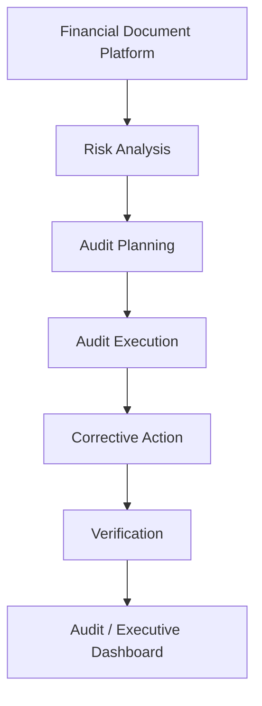

# Sprint 37: Internal Audit Management Platform

## Objective

Internal Audit Management Platform ใช้บริหารงานตรวจสอบภายในที่เชื่อมกับ Financial Document Platform ตั้งแต่ risk analysis, audit planning, audit execution, corrective action, verification และ executive dashboard

รองรับ:

- 100+ branches
- Accounting
- Internal Audit
- Regional Manager
- Executive

ระบบยังคงใช้เฉพาะ local/free stack:

- Ollama
- PaddleOCR
- OpenCV
- Mock fallback

ห้ามใช้ OpenAI, Gemini, Claude หรือ paid API

## Architecture

## Module

สร้างโมดูล `src/audit-management/`

- `AuditRepository.js`
- `AuditPlanService.js`
- `AuditScheduleService.js`
- `AuditCaseService.js`
- `AuditFindingService.js`
- `CorrectiveActionService.js`
- `AuditEvidenceService.js`
- `AuditReportService.js`
- `index.js`

V1 ใช้ mock/localStorage และออกแบบให้เปลี่ยนเป็น Firestore ได้ภายหลัง

## Entity: AuditPlan

| Field | Description |
| --- | --- |
| auditPlanId | รหัสแผนตรวจ |
| title | ชื่อแผน |
| year | ปี |
| quarter | ไตรมาส |
| region | ภูมิภาค |
| branchList | รายการสาขา |
| auditType | ประเภท audit |
| status | DRAFT, PENDING_APPROVAL, APPROVED, ACTIVE, CLOSED |
| createdBy | ผู้สร้าง |
| approvedBy | ผู้อนุมัติ |
| createdAt | เวลาสร้าง |

## Entity: AuditCase

| Field | Description |
| --- | --- |
| auditCaseId | รหัส case |
| branchCode | สาขา |
| businessDate | วันที่เกี่ยวข้อง |
| auditType | ประเภท audit |
| riskScore | คะแนนความเสี่ยง |
| priority | LOW, MEDIUM, HIGH, CRITICAL |
| status | OPEN, IN_PROGRESS, WAITING_CORRECTIVE_ACTION, VERIFICATION, CLOSED, REOPENED |
| assignedAuditor | auditor |
| createdAt | เวลาสร้าง |
| closedAt | เวลาปิด |

Audit Case ต้องเชื่อมกับ:

- Shift Reconciliation
- Business Exception
- Fraud Pattern
- Source Pay-in Record

## Entity: AuditFinding

| Field | Description |
| --- | --- |
| findingId | รหัส finding |
| auditCaseId | อ้างอิง case |
| category | ประเภท finding |
| severity | LOW, MEDIUM, HIGH, CRITICAL |
| description | รายละเอียด |
| recommendation | ข้อเสนอแนะ |
| rootCause | สาเหตุ |
| owner | ผู้รับผิดชอบ |
| dueDate | กำหนดเสร็จ |
| status | สถานะ |
| createdAt | เวลาสร้าง |

ทุก finding ต้องมีหลักฐาน ผู้รับผิดชอบ กำหนดเสร็จ และสถานะ

## Entity: CorrectiveAction

| Field | Description |
| --- | --- |
| actionId | รหัส corrective action |
| findingId | อ้างอิง finding |
| owner | ผู้รับผิดชอบ |
| dueDate | วันครบกำหนด |
| status | OPEN, IN_PROGRESS, SUBMITTED, VERIFIED, REJECTED, OVERDUE |
| completionDate | วันที่แจ้งแก้ไขเสร็จ |
| verificationResult | ผลตรวจยืนยัน |

Corrective Action ต้องติดตามได้จนปิดเรื่อง

## Audit Type

- Routine Audit
- Special Audit
- Follow-up Audit
- Random Audit
- Risk-based Audit

## Finding Category

- Document
- Cash
- Payment
- Workflow
- Security
- Policy
- Compliance
- System

## Audit Planning

รองรับ:

- Annual Plan
- Quarterly Plan
- Monthly Plan
- Create / Edit / Approve

## Audit Schedule

รองรับ:

- Assign Auditor
- Assign Branch
- Assign Region
- Schedule Visit
- Reschedule

## Audit Execution

Auditor สามารถ:

- Open Case
- Add Finding
- Attach Evidence
- Comment
- Close Case

## Evidence

รองรับ:

- Image
- PDF
- Excel
- Video
- ZIP
- Document Version Evidence

Evidence สามารถผูกกับ audit case, finding หรือ corrective action

## Corrective Action Workflow

Accounting, Branch และ Regional Manager สามารถ:

- ตอบกลับ
- Upload/แนบหลักฐาน
- แจ้งผลการแก้ไข

Auditor สามารถ:

- Approve
- Reject
- Request More Evidence
- Reopen Finding

## Risk Integration

ระบบเชื่อมข้อมูลจาก:

- Business Exception
- Fraud Pattern
- Risk Score
- Shift Reconciliation

เพื่อสร้าง Audit Case แบบ risk-based audit

## Dashboard

Audit Dashboard:

- Audit Progress
- Open Findings
- Overdue Actions
- High Risk Branches
- Audit Coverage

Executive Dashboard:

- Audit KPI
- Compliance %
- Open Findings
- Closed Findings
- Critical Findings

Regional Dashboard:

- Audit Status ของสาขาใน region

## Notification

รองรับ In App Notification ใน V1 และ future channel:

- Email
- LINE
- Microsoft Teams

## History

ต้องเก็บ:

- Audit History
- Finding History
- Corrective Action History
- Evidence History

## Audit Log

ทุก action ต้องถูกบันทึก:

- Plan save / approve
- Schedule / reschedule
- Case open / close
- Finding create / update
- Corrective action submit / verify / reject
- Evidence attach

## Permission

| Role | Permission |
| --- | --- |
| Branch | ตอบ corrective action และแนบหลักฐานของสาขาตนเอง |
| Accounting | ตอบ corrective action และดู case ตามสิทธิ์ |
| Internal Audit | จัดการ plan, schedule, case, finding, verification |
| Regional Manager | ดูและตอบ case ใน region |
| Admin | จัดการทั้งหมด |
| Executive | ดู dashboard |

## Performance

รองรับ:

- 100+ branches
- 500+ concurrent users
- Millions audit records

แนวทาง:

- Pagination
- Lazy loading
- Filter ตาม branch, region, status, auditor, due date
- Background sync จาก risk engine

## Scalability

รองรับการเพิ่ม:

- Audit Type
- Finding Category
- Corrective Action Workflow

โดยไม่ต้องแก้ architecture หลัก

## Important Rules

1. Audit Case ต้องเชื่อมกับ Shift Reconciliation, Business Exception และ Fraud Pattern ได้
2. ทุก Finding ต้องมีหลักฐาน ผู้รับผิดชอบ กำหนดเสร็จ และสถานะ
3. Corrective Action ต้องติดตามได้จนปิดเรื่อง
4. ทุกการอนุมัติ ปฏิเสธ และแก้ไขต้องสร้าง Audit Log
5. Business Logic ต้องแยกจาก Workflow, AI, Storage และ Database
6. ต้องรองรับการใช้งานจริง 100+ สาขา และขยายต่อได้
