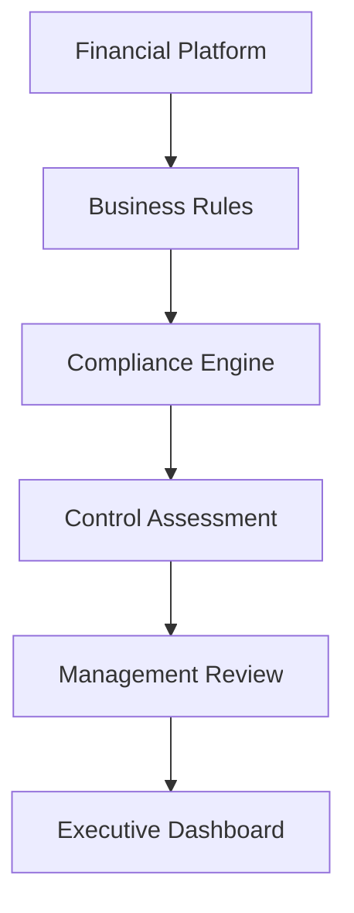

# Sprint 38: Compliance & Corporate Governance Platform

## Objective

Compliance & Corporate Governance Platform ใช้สนับสนุนการควบคุมภายใน การปฏิบัติตามนโยบายบริษัท และการกำกับดูแลระดับองค์กร โดยเชื่อมกับ Financial Document Platform, Business Exception, Fraud Pattern และ Internal Audit

รองรับ:

- 100+ branches
- Accounting
- Internal Audit
- Compliance
- Regional Manager
- Executive

ระบบยังคงใช้เฉพาะ local/free stack:

- Ollama
- PaddleOCR
- OpenCV
- Mock fallback

ห้ามใช้ OpenAI, Gemini, Claude หรือ paid API

## Architecture

## Module

สร้างโมดูล `src/compliance/`

- `ComplianceRepository.js`
- `ComplianceService.js`
- `ComplianceRuleEngine.js`
- `ControlAssessmentService.js`
- `PolicyService.js`
- `ComplianceCaseService.js`
- `ComplianceReportService.js`
- `ComplianceDashboardService.js`
- `index.js`

V1 ใช้ mock/localStorage และแยก service layer เพื่อเปลี่ยนเป็น Firestore หรือ enterprise database ได้ภายหลัง

## Entity: CompliancePolicy

| Field | Description |
| --- | --- |
| policyId | รหัส policy |
| policyCode | code policy |
| policyName | ชื่อนโยบาย |
| category | หมวดหมู่ |
| version | version policy |
| effectiveDate | วันที่เริ่มมีผล |
| reviewDate | วันที่ต้องทบทวน |
| owner | เจ้าของ policy |
| status | DRAFT, ACTIVE, RETIRED, CANCELLED, UNDER_REVIEW |

ทุก policy ต้องรองรับ version control

## Entity: ComplianceCase

| Field | Description |
| --- | --- |
| caseId | รหัส compliance case |
| branchCode | สาขา |
| businessDate | วันที่เกี่ยวข้อง |
| policyId | policy ที่เกี่ยวข้อง |
| riskLevel | LOW, MEDIUM, HIGH, CRITICAL |
| status | OPEN, IN_REVIEW, MANAGEMENT_REVIEW, REMEDIATION, CLOSED |
| assignedTo | ผู้รับผิดชอบ |
| createdAt | เวลาสร้าง |
| closedAt | เวลาปิด |

Compliance Case สามารถเชื่อมกับ:

- Business Exception
- Fraud Pattern
- Audit Finding
- Source Financial Record

## Entity: ControlAssessment

| Field | Description |
| --- | --- |
| assessmentId | รหัส assessment |
| branchCode | สาขา |
| controlCode | รหัส control |
| controlName | ชื่อ control |
| assessmentResult | ผลประเมิน |
| riskScore | คะแนนความเสี่ยง |
| reviewer | ผู้ประเมิน |
| reviewDate | วันที่ประเมิน |
| status | สถานะ |

ทุก Control Assessment ต้องมี:

- หลักฐาน
- ผู้ประเมิน
- วันที่ประเมิน
- ผลการประเมิน

## Policy Category

- Accounting
- Cash Handling
- Deposit
- Document
- Security
- IT
- Internal Control
- Compliance
- Audit

## Control Status

- Compliant
- Non-Compliant
- Need Improvement
- Not Applicable

## Compliance Rule

รองรับ:

- Policy Validation
- Control Validation
- Business Rule Validation
- Workflow Validation

Rule Engine ตรวจ:

- Policy review overdue
- Non-compliant control
- High-risk financial record
- Critical compliance case

## Policy Management

Admin สามารถ:

- สร้าง policy
- แก้ไข policy
- ยกเลิก policy
- สร้าง policy version ใหม่
- Activate policy

ทุก action ต้องสร้าง history และ audit log

## Control Assessment

Accounting, Audit และ Compliance สามารถ:

- ประเมินผล
- บันทึกผล
- แนบหลักฐาน

หลักฐานรองรับ:

- Image
- PDF
- Excel
- Video
- ZIP

## Compliance Dashboard

แสดง:

- Policy Status
- Compliance %
- Non-Compliance
- Open Case
- Overdue
- High Risk Policy

## Executive Dashboard

แสดง:

- Corporate Compliance
- Internal Control Status
- Policy Compliance
- Risk Summary

## Regional Dashboard

Regional Manager เห็น compliance status เฉพาะสาขาใน region

## Notification

V1 รองรับ In App Notification ใน architecture และ future channel:

- Email
- LINE
- Microsoft Teams

## History

ต้องเก็บ:

- Policy History
- Compliance History
- Control Assessment History
- Evidence History

## Audit Log

ทุก action ต้องถูกบันทึก:

- Policy create/update/approve/cancel
- Control assessment create/update
- Evidence attach
- Compliance case create/close
- Source sync

## Permission

| Role | Permission |
| --- | --- |
| Branch | อ่านข้อมูล/ตอบงานที่เกี่ยวข้องกับสาขาตนเองในอนาคต |
| Accounting | ทำ control assessment และดู case ตามสิทธิ์ |
| Internal Audit | ดูและเชื่อมกับ audit finding |
| Compliance | จัดการ compliance workflow |
| Regional Manager | ดู region |
| Admin | จัดการ policy และระบบทั้งหมด |
| Executive | ดู dashboard |

## Performance

รองรับ:

- 100+ branches
- 500+ concurrent users
- Millions compliance records

แนวทาง production:

- Pagination
- Lazy loading
- Filter ตาม branch, region, policy, status, risk level
- Background sync จาก Business Exception, Fraud Pattern และ Audit Finding

## Scalability

รองรับการเพิ่ม:

- Policy
- Control
- Assessment
- Workflow

โดยไม่ต้องแก้ source code หรือ architecture หลัก

## Important Rules

1. ทุก Policy ต้องรองรับ Version Control
2. ทุก Control Assessment ต้องมีหลักฐาน ผู้ประเมิน วันที่ประเมิน และผลการประเมิน
3. Compliance ต้องเชื่อมกับ Business Exception, Fraud Pattern และ Audit Finding ได้
4. ทุกการแก้ไข อนุมัติ และยกเลิก ต้องสร้าง Audit Log
5. Business Logic ต้องแยกจาก Workflow, AI, Storage และ Database
6. ระบบต้องขยายเป็น Enterprise Governance Platform ได้
7. ฝ่าย IT ต้องกำหนด Policy และ Control ใหม่จากระบบได้โดยไม่แก้ source code
