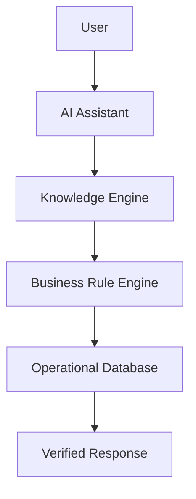

# Sprint 39: Enterprise AI Knowledge & Decision Support Platform

## Objective

Enterprise AI Knowledge & Decision Support Platform เป็น AI Assistant สำหรับ Accounting, Internal Audit, Regional Manager และ Executive โดยต้องตอบจากข้อมูลจริงภายในระบบเท่านั้น ห้ามคาดเดา ห้ามสร้างข้อมูล และทุกคำตอบต้องมี source reference

ระบบยังคงใช้เฉพาะ local/free stack:

- Ollama
- PaddleOCR
- OpenCV
- Mock / deterministic knowledge engine

ห้ามใช้ OpenAI, Gemini, Claude หรือ paid API

## Architecture

## Module

สร้างโมดูล `src/ai-assistant/`

- `KnowledgeService.js`
- `DecisionSupportService.js`
- `QueryEngine.js`
- `PromptBuilder.js`
- `ContextRetriever.js`
- `BusinessRuleInterpreter.js`
- `ResponseFormatter.js`
- `ConversationService.js`
- `index.js`

## Entity: KnowledgeSession

| Field | Description |
| --- | --- |
| sessionId | รหัส session |
| userId | ผู้ถาม |
| role | role |
| branchCode | branch scope |
| question | คำถาม |
| generatedAnswer | คำตอบที่สร้างจากข้อมูลจริง |
| confidence | HIGH, MEDIUM, LOW |
| sourceReference | source ที่ใช้ตอบ |
| processingTime | เวลาประมวลผล |
| createdAt | เวลาสร้าง |

## Knowledge Source

รองรับ:

- Shift Report
- Pay-in
- Bank Transfer
- MaeManee
- CRM
- Debtor Transfer
- Workflow
- Business Exception
- Fraud Pattern
- Audit Finding
- Compliance
- Master Data

## No Hallucination Rule

AI Assistant ต้อง:

1. ตอบจากข้อมูลจริงในระบบเท่านั้น
2. ไม่สร้างข้อมูลเอง
3. ไม่คาดเดา
4. ถ้าไม่พบ source ให้ตอบว่าไม่พบข้อมูลในระบบ
5. ถ้า confidence ต่ำให้แนะนำเปิดเอกสารต้นฉบับ

## Supported Question Examples

- วันนี้มีสาขาไหนยังไม่ส่งเอกสาร
- สาขาไหนมียอดต่างเกิน 500 บาท
- แสดง Case ที่ยังไม่ปิด
- Audit Finding ที่ยังไม่แก้ไข
- สาขาไหนมี Manual Override มากที่สุด
- ยอด Pay-in วันนี้เท่าไร
- AI Accuracy เดือนนี้

## Response Format

ทุกคำตอบต้องมี:

- Summary
- Detail
- Source Reference
- Confidence
- Recommendation เมื่อ confidence ต่ำ

Source Reference ต้องแสดง:

- Source
- Business Date
- Branch
- Document
- Reference

## Role Permission

| Role | Scope |
| --- | --- |
| Branch | เฉพาะสาขาตัวเอง |
| Accounting | ตามสิทธิ์ |
| Audit | ทุกสาขา |
| Executive | ทุกข้อมูล |
| Regional Manager | เฉพาะ region |

ทุกคำถามต้องผ่าน permission check ก่อน retrieve context

## Conversation

รองรับ:

- Conversation History
- Session History
- Favorite Question
- Top Questions

ทุก session ถูกเก็บใน localStorage V1 และออกแบบให้เปลี่ยนเป็น Firestore ได้

## Suggested Question

ระบบแนะนำคำถามตาม role เช่น:

- Branch: สาขาของฉันยังขาดเอกสารอะไร
- Accounting: สาขาไหนมียอดต่างเกิน 500 บาท
- Audit: Audit Finding ที่ยังไม่แก้ไข
- Executive: AI Accuracy เดือนนี้

## Knowledge Search

รองรับ:

- Natural language แบบ rule-based
- Keyword
- Filter business date
- Branch
- Shift
- Document Type

## Decision Support

AI Assistant สามารถสรุป:

- Trend
- Risk
- Pending Case
- Manual Override
- AI/OCR Accuracy

แต่ต้องอ้างอิงข้อมูลจริงเท่านั้น

## Confidence

| Level | Meaning |
| --- | --- |
| HIGH | มี source หลายรายการรองรับ |
| MEDIUM | มี source บางส่วนรองรับ |
| LOW | source น้อยหรือไม่พบข้อมูล |

ถ้า confidence LOW ต้องแนะนำให้เปิดเอกสารต้นฉบับ

## Audit Log

ทุกคำถามและคำตอบต้องสร้าง audit log:

- `AI_ASSISTANT_QUESTION`

และบันทึก KnowledgeSession

## Dashboard

แสดง:

- AI Usage
- Top Questions
- Average Response Time
- Knowledge Coverage

## Security

- Role Based Access
- Data Isolation
- Conversation Log
- Source Reference

## Performance

เป้าหมาย response time < 3 วินาที

แนวทาง:

- Cache
- Index
- Background Search
- Filter context ก่อน query
- ไม่ query ข้อมูลขนาดใหญ่จาก UI โดยตรง

## Scalability

รองรับ:

- 100+ branches
- 500+ concurrent users
- Millions knowledge records

## Future Extension

รองรับการขยายในอนาคต:

- Voice Assistant
- Microsoft Teams Bot
- LINE OA
- Webhook / API Gateway

โดยไม่เปลี่ยน architecture หลัก

## Important Rules

1. AI ต้องตอบจากข้อมูลจริงเท่านั้น
2. ทุกคำตอบต้องอ้างอิงข้อมูลในระบบ
3. ห้าม AI สร้างข้อมูลหรือคาดเดา
4. Business Logic ต้องแยกจาก AI
5. ทุกคำถามต้องผ่าน permission check
6. ทุก session ต้องสร้าง audit log
7. รองรับ 100+ สาขา และ 500+ ผู้ใช้งานพร้อมกัน
