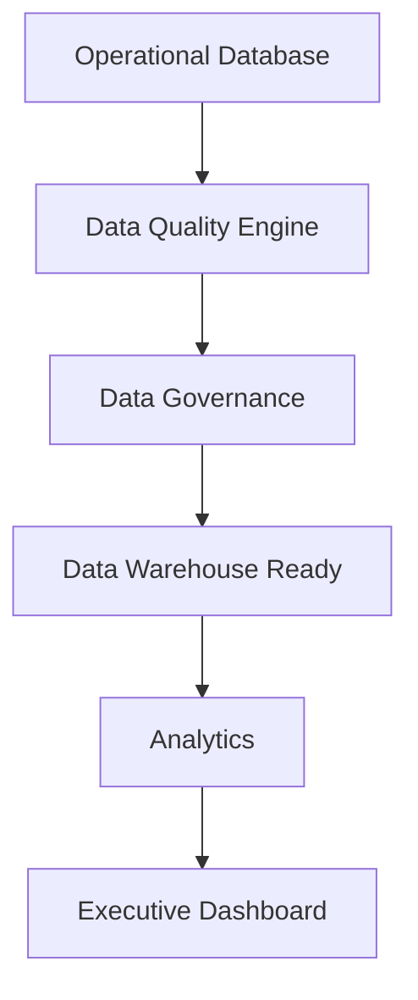

# Sprint 40: Enterprise Data Platform & Data Governance

## Objective

Enterprise Data Platform & Data Governance Framework ใช้ทำให้ข้อมูลของทั้งองค์กรมีคุณภาพ ตรวจสอบย้อนหลังได้ และพร้อมเชื่อมต่อกับระบบภายนอก เช่น Data Warehouse, Power BI, Microsoft Fabric, Lakehouse, ERP, POS และ REST API

รองรับ:

- 100+ branches
- 500+ concurrent users
- Millions records
- 100,000,000+ records ในอนาคต

ระบบยังคงใช้เฉพาะ local/free stack:

- Ollama
- PaddleOCR
- OpenCV
- Mock/local processing

ห้ามใช้ OpenAI, Gemini, Claude หรือ paid API

## Architecture

## Module

สร้างโมดูล `src/data-governance/`

- `DataGovernanceRepository.js`
- `DataGovernanceService.js`
- `DataQualityService.js`
- `DataValidationEngine.js`
- `MasterDataValidation.js`
- `DuplicateDetectionService.js`
- `DataLineageService.js`
- `MetadataService.js`
- `DataCatalogService.js`
- `RetentionPolicyEngine.js`
- `index.js`

## Entity: DataQualityIssue

| Field | Description |
| --- | --- |
| issueId | รหัส issue |
| branchCode | สาขา |
| businessDate | วันที่ธุรกิจ |
| entityType | ประเภท entity |
| recordId | record ที่เกี่ยวข้อง |
| issueType | ประเภทปัญหา |
| severity | LOW, MEDIUM, HIGH, CRITICAL |
| status | OPEN, RESOLVED |
| createdAt | เวลาสร้าง |
| resolvedAt | เวลาปิด |

## Entity: Metadata

| Field | Description |
| --- | --- |
| metadataId | รหัส metadata |
| entityName | entity |
| fieldName | field |
| dataType | data type |
| description | คำอธิบาย |
| required | required/optional |
| owner | data owner |
| classification | classification |
| createdAt | เวลาสร้าง |

ทุก entity ต้องมี metadata และ data owner

## Data Quality Rules

ตรวจสอบ:

- Missing Data
- Duplicate Data
- Invalid Format
- Broken Reference
- Business Rule Violation
- Outlier Detection

## Duplicate Detection

รองรับ:

- Reference
- Document
- OCR Result
- AI Result
- Transaction

## Data Lineage

ติดตาม:

- Source
- Transformation
- Validation
- Workflow
- Archive

ใช้เพื่อ audit trail และตรวจสอบย้อนหลัง

## Data Catalog

แสดง:

- Entity
- Field
- Description
- Owner
- Business Rule
- Classification

## Data Classification

- Public
- Internal
- Confidential
- Restricted

## Retention Policy

รองรับ:

- 1 ปี
- 2 ปี
- 5 ปี
- 7 ปี
- 10 ปี
- Permanent

## Data Archive

รองรับ:

- Archive
- Restore
- Version
- History

V1 ใช้ mock/localStorage ก่อน และเตรียม schema สำหรับ Storage/Warehouse ใน production

## Data Validation

รองรับ trigger:

- Background Job
- Schedule
- Manual
- Before Import
- Before Export

## Dashboard

แสดง:

- Data Quality Score
- Duplicate Records
- Missing Data
- Business Rule Error
- Validation Trend

## Executive Dashboard

แสดง:

- Company Data Quality
- Top Quality Issue
- Branch Data Score
- Master Data Health

## Master Data Health

ตรวจ:

- Branch
- Merchant
- Bank
- Business Rule
- Workflow
- Policy

## Import / Export Validation

รองรับ:

- Excel
- CSV
- API
- PDF data export

ทุก import/export ต้องสร้าง audit log

## Permission

| Role | Permission |
| --- | --- |
| Branch | อ่านข้อมูลที่เกี่ยวข้องกับสาขาในอนาคต |
| Accounting | ดูคุณภาพข้อมูลด้านบัญชี |
| Audit | ตรวจสอบ governance และ lineage |
| Compliance | ใช้ควบคุม policy/data control |
| Admin | จัดการ metadata, retention, archive |
| Executive | ดู dashboard |

## Audit Log

ต้องสร้าง audit log สำหรับ:

- Data edit
- Import validation
- Export validation
- Archive
- Retention policy change
- Metadata change

## Performance

ใช้:

- Background Job
- Cache
- Index
- Partition-ready model

UI ต้องไม่ query ข้อมูลจำนวนมากโดยตรง

## Scalability

รองรับ:

- 100+ branches
- 500+ branches
- 1,000+ branches
- 100,000,000+ records

## Future Ready

เตรียมรองรับ:

- Data Warehouse
- Power BI
- Microsoft Fabric
- Lakehouse
- ERP
- POS
- REST API

ผ่าน Integration Layer โดยไม่ผูกกับ vendor

## Important Rules

1. ทุกข้อมูลต้องมี Data Owner
2. ทุก Entity ต้องมี Metadata
3. ทุกข้อมูลต้องผ่าน Data Validation ก่อนใช้งาน
4. Business Rule ต้องเปลี่ยนได้โดย config
5. รองรับ Data Lineage เพื่อ audit ย้อนหลัง
6. Business Logic ต้องแยกจาก AI, Analytics, Storage และ Database
7. รองรับ Power BI, Microsoft Fabric, ERP, POS ผ่าน Integration Layer
8. เตรียมระบบสำหรับ Version 3.0 Enterprise Data Platform โดยไม่เปลี่ยน architecture หลัก
